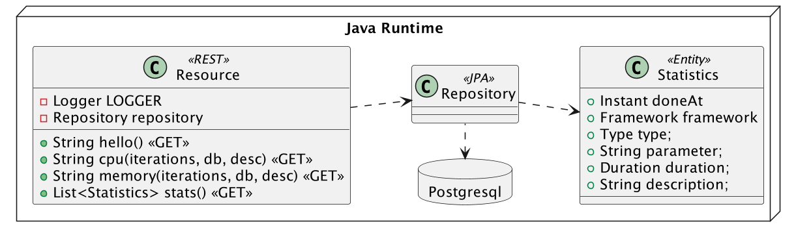
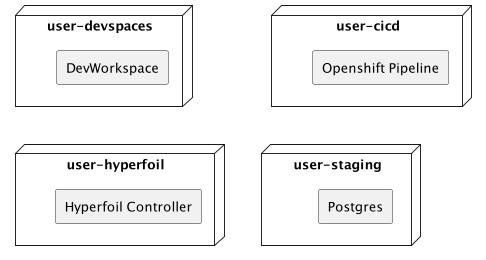
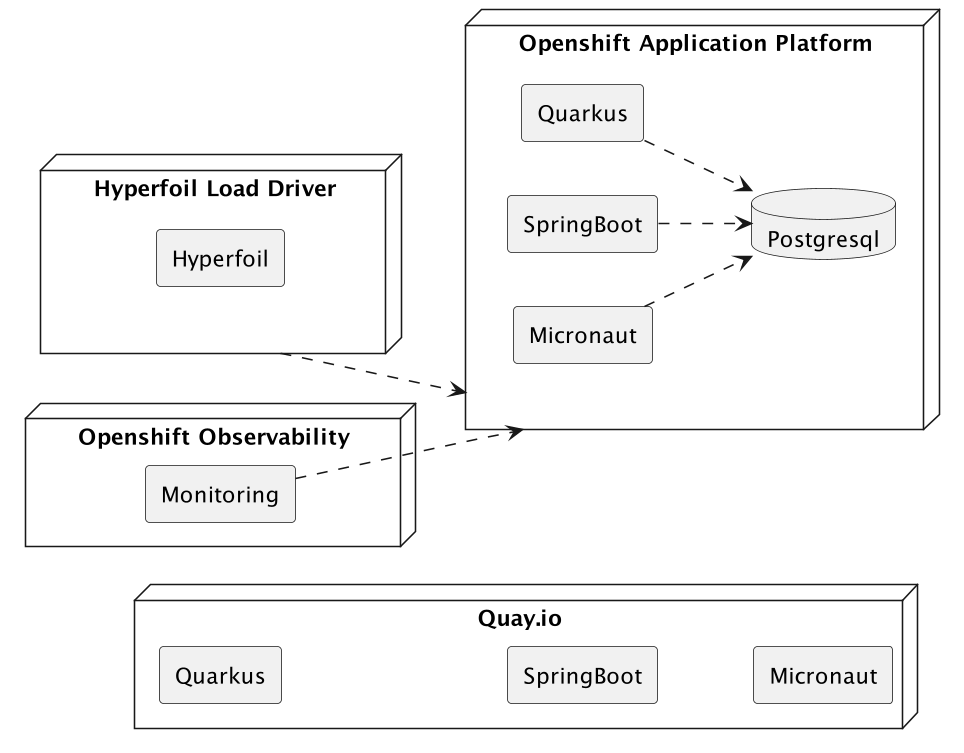
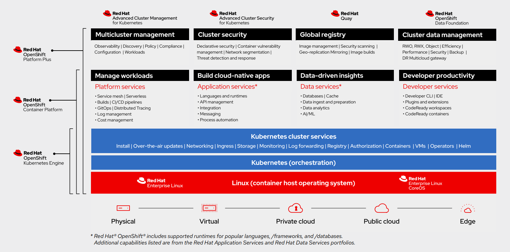

:guid: %guid%
:user: %user%
:sectlinks:
:sectanchors:
:markup-in-source: verbatim,attributes,quotes
:source-highlighter: highlight.js

= Modern Cloud-native Java runtimes performance monitoring on Red Hat Openshift

== Welcome
During this workshop attendees will have the opportunity to participate in a hands-on Lab, 
introductory-level session focused on performance monitoring using different Modern cloud-native Java runtimes. 
Throughout the session, participants will execute tasks such as build, test and deploy microservices using link:https://quarkus.io[Quarkus^], link:https://spring.io[Spring Boot(R)^] and link:https://micronaut.io[Micronaut(R)^], 
on top of the link:https://www.redhat.com/en/technologies/cloud-computing/openshift[Red Hat(R) OpenShift(R)^] Application Platform and run load testing scenarios while monitoring the application performance. 
Specifically, attendees will analyze CPU load and memory usage, establish a baseline, and then observe the impact of scaling up application containers.

This workshop runs in a shared Openshift Cluster hosted on a Red Hat lab environment, but can be easily reproduced in any OpenShift cluster.

What you are going to do:

* Create your own GitHub Repo based on a GitHub Template
* Develop three microservices that consume CPU and memory, each one using a different runtime stack
  ** Quarkus
  ** Spring Boot
  ** Micronaut
* Compile, package and containerize these microservices
* Run these microservices locally on your own Dev Workspace using Red Hat link:https://developers.redhat.com/products/openshift-dev-spaces/overview[Openshift DevSpaces^]
* Build an immutable container image for each microservice using Openshift Pipelines (based on link:https://tekton.dev[Tekton^])
* Deploy your containers to a staging namespace created on Openshift
* Execute and monitor the microservices using different performance parameters
* Load test the microservices
* Analyze CPU load and scale containers appropriately
* Analyze memory and scale containers appropriately
* And much more!

Are you ready to get started? Proceed to the next step to learn more about your environment and get started with the Lab.

== Presenting the Workshop
This workshop is about understanding the performance of Java runtimes in a containerized environment in the cloud. It is a hands-on workshop, so you will be doing many things in your development environment and on Red Hat Openshift.

Today, most of us containerize our Java applications and then deploy them to the cloud. 
But how do we know if our application is performing well? 
What do we do if we see a CPU or memory usage spike?
Do we scale out or scale up? 
Do we change the JVM parameters? Do we change the container size? 
And what about having native binaries and compiling our code with link:https://www.graalvm.org[GraalVM^]?

=== What Is This Workshop About?

To understand performance in a containerized environment we need a few simple algorithms that consume CPU and memory.
We will then develop these same algorithms in https://quarkus.io[Quarkus], https://spring.io/projects/spring-boot[Spring Boot] and https://micronaut.io[Micronaut], deploy them to the link:https://www.redhat.com/en/technologies/cloud-computing/openshift[Red Hat(R) OpenShift(R)^] Application Platform and monitor their performance.

The algorithm consuming CPU will be a simple loop.
The higher the numner of iterations, the more CPU it consumes:

[source,java,role=copy]
----
        while (iterations > 0) {
            if (iterations % 20000 == 0) {
                try {
                    Thread.sleep(20);
                } catch (InterruptedException ie) {
                }
            }
            iterations--;
        }
----

The algorithm consuming memory will be a simple hashmap that we will fill with bytes.
The more bits you have, the more memory it uses:

[source,java,indent=0]
----
        HashMap hunger = new HashMap<>();
        for (int i = 0; i < bites * 1024 * 1024; i += 8192) {
            byte[] bytes = new byte[8192];
            hunger.put(i, bytes);
            for (int j = 0; j < 8192; j++) {
                bytes[j] = '0';
            }
        }
----

=== What Will You Be Developing?

You will be developing 3 microservices, each doing the exact same thing (consuming CPU and memory), but using a different Java runtime: Quarkus, Spring Boot and Micronaut:

* A REST endpoint (used as an entry point) that will execute our CPU and memory consuming algorithms
* A repository used to store the results of the CPU and memory consuming algorithms
* A statistics entity mapped to the relational database

=== What Is Already Provided for You?

You will be working on a shared Openshift cluster where each user has a set of four projects (a.k.a namespaces). 

 * `user-devspaces`: this namespace hosts your Developer Workspace where you will develop (inner-loop process) the applications using Openshift Devspaces.
 * `user-cicd`: this namespace hosts the Openshift Pipeline you will use to trigger the build and deploy (outer-loop process) of each application.
 * `user-hyperfoil`: this namespace hosts the Load Driver Controller used to generate load against the applications deployed on the staging environment.
 * `user-staging`: this is the namespace that will host the three applications you will build.

As a developer you will interact with the Openshift Platform using different tools to build, test, deploy and monitor your microservices.

=== What Will You Deploy?

Once developed and tested locally, you will build your microservices' container images and deploy them to the Openshift Container Platform:

* You will create an Quay.io Registry Account to store and manage the container images
* You will run a Tekton Pipeline that:
  ** builds each microservice into a container image;
  ** pushes each application container image to your Quay.io Registry account;
  ** and finally deploys each one on a staging namespace created on Openshift.

=== Structure of the Workshop

You have this material in your hands, and you can now follow it step-by-step.
The structure of this workshop is as follows:

* `_Accessing your DevWorkspace_`:
In this section you will access your DevWorkspace that was pre-provisioned on Openshift DevSpaces.
* `_Developing the Quarkus Application_`:
In this section you will develop a microservice using Quarkus, test it and run it locally.
* `_Developing the Micronaut Application_`:
In this section you will build, test and deploy a microservice using Micronaut.
* `_Developing the Spring Boot Application_`:
In this section you will build, test and deploy a microservice using Spring Boot.
* `_Setting Up the Quay.io Registry_`:
This section requires you to create a personal free account on link:https://quay.io[Quay.io^] - a Managed Container Registry Service hosted hosted by Red Hat.
* `_Deploying the Applications_`:
In this section you will set up a CI/CD pipeline using Openshift Pipelines (based on Tekton) so that our application builds and deploys in an automated way.
* `_Load Testing, Scaling and Monitoring the Applications_`:
In this section you will add some load to your microservices, monitor them, scale them, check their logs, etc.
* `_Going Native_`:
In this section you will compile your microservices with GraalVM (optional), package and deploy them to Openshift, and see how it impacts the performance.

== Presenting Red Hat Openshift

Red Hat(R) OpenShift(R), the industry's leading hybrid cloud application platform powered by Kubernetes, brings together tested and trusted services to reduce the friction of developing, modernizing, deploying, running, and managing applications. OpenShift delivers a consistent experience across public cloud, on-premise, hybrid cloud, or edge architecture.

OpenShift Container Platform includes multiple advanced capabilities that are tested and integrated with the underlying certified Kubernetes environment.

* *Automated* Day 1 and Day 2 operations.
** Operators provide *automated installation, upgrades and life cycle management* for applications, ensuring applications are running correctly and making necessary changes to comply with the desired configuration.
** Helm brings a *Kubernetes-native package manager* that developers can use to package their applications and define how to package, deploy, and configure them. It can also automate Day 1 tasks and a limited number of Day 2 operations. 
* *Red Hat OpenShift Service Mesh* provides a uniform way to *manage, connect, and observe applications* as managing and security between services become more challenging.
* *Red Hat OpenShift Serverless* allows an application to *use compute resources and automatically scale up or down based on use*, driven on demand from some event sources. 
* *Red Hat OpenShift Pipelines* brings a *Kubernetes-native continuous integration and continuous development (CI/CD)* solution based on Tekton that provides a streamlined user experience through the OpenShift console. 
* *Red Hat OpenShift GitOps* is built from the open source Argo CD project and lets IT teams *implement GitOps workflows for cluster configuration and application delivery* for more efficient, security-focused, and scalable software development.
* *Red Hat OpenShift Virtualization* brings *virtual machines to OpenShift* to modernize existing applications or run them alongside containers, and serverless, in a Kubernetes-native architecture.
* *Edge computing* includes 3-node clusters, remote worker nodes, and single nodes to provide organizations *full Kubernetes capabilities in a smaller footprint*. 
* *Support for diverse workloads with consistency* across applications with a common platform to accelerate the deployment of intelligent applications across a hybrid cloud environment. 
** Supported workloads include: 
*** Databases.
*** Data analytics. 
*** AI/ML software, programming languages, and frameworks.
*** Logging and monitoring. 
*** Web and application servers.
*** Message broker services. 

The following diagram shows the OpenShift capabilities that is provided with the platform:

Check this link:https://www.redhat.com/en/resources/openshift-container-platform-datasheet[link] to find out more information about Red Hat OpenShift and its features.

For this workshop, we'll use in particular the following services and capabilities available in the Platform:

* *Openshift Container Platform*: a unified platform to build, modernize, and deploy applications at scale.
* *Red Hat Quay.io*: a private container registry to store our Container images.
* *Openshift Pipelines*: a cloud-native, continuous integration and continuous delivery (CI/CD) solution based on Kubernetes resources backed by link:https://tekton.dev[Tekton].
* *Openshift DevSpaces*: the OpenShift-native developer workspace server and IDE based on link:https://www.eclipse.org/che/[Eclipse Che project^]
* *OpenShift Serverless*: based on Knative
* *OpenShift Monitoring*: based on Prometheus
* *OpenShift Logging*: based on Loki
* *Crunchy Data*: a Postgres certified Operator from link:https://www.crunchydata.com[Crunchy Data^], gives you a declarative Postgres solution that automatically manages your PostgreSQL clusters on Openshift/Kubernetes.
