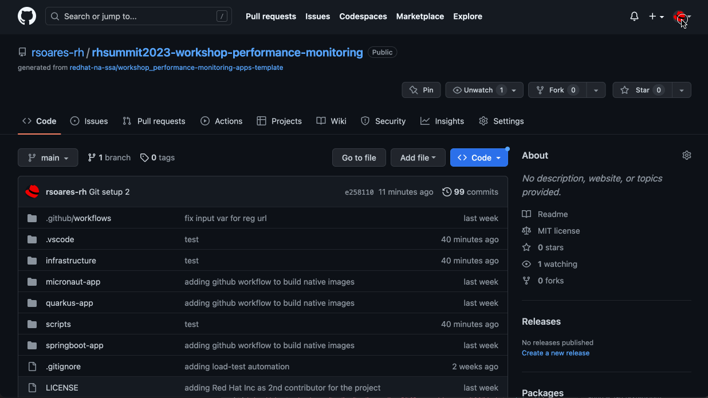
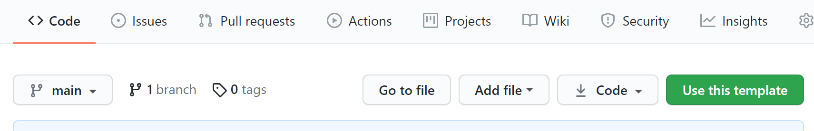
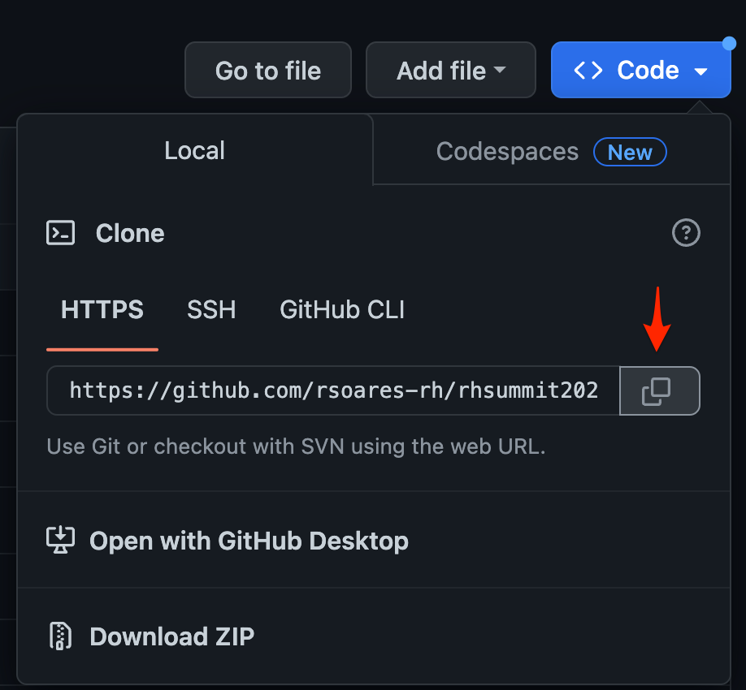
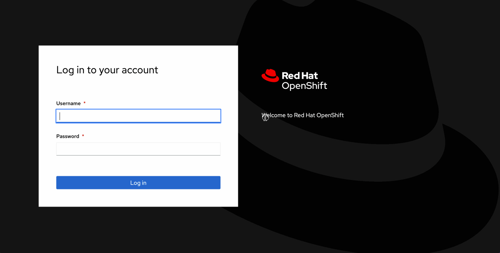
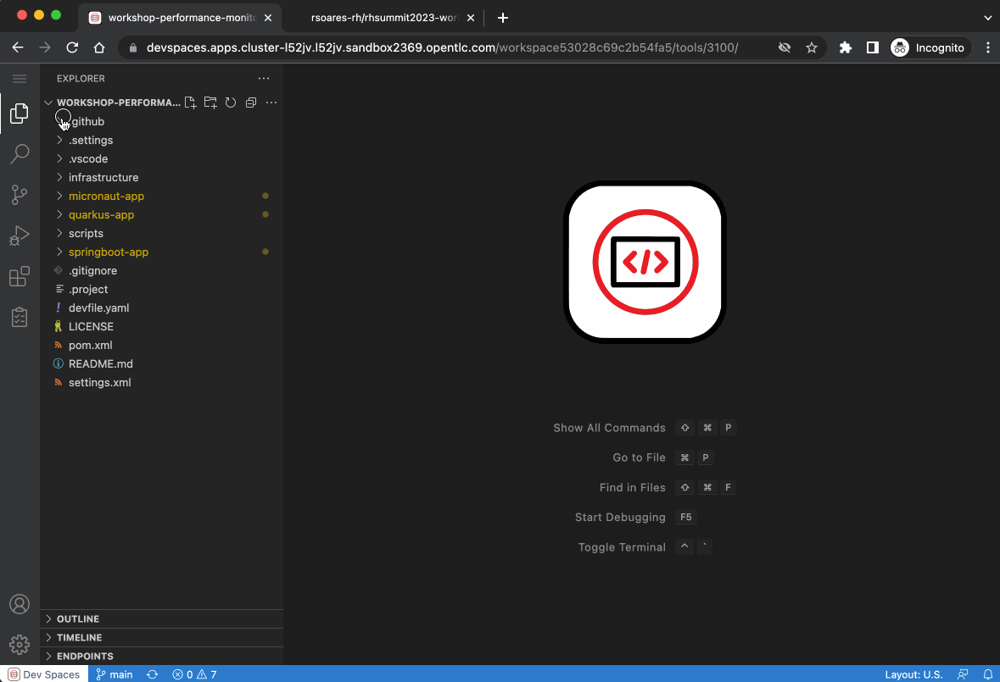
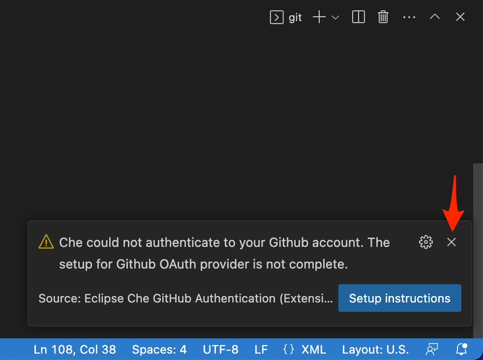
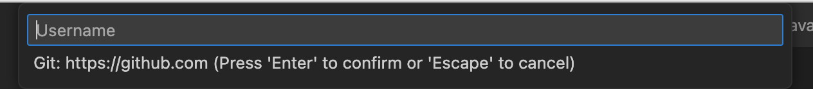

:guid: %guid%
:user: %user%

:openshift_user_password: %password%
:openshift_console_url: %openshift_console_url%
:user_devworkspace_dashboard_url: https://devspaces.%openshift_cluster_ingress_domain%
:user_devworkspace_url: https://devspaces.%openshift_cluster_ingress_domain%/dashboard/#/ide/%user%-devspaces/workshop-performance-monitoring-apps
:template-github-url: https://github.com/redhat-na-ssa/workshop_performance-monitoring-apps.git
:hyperfoil_web_cli_url: https://%user%:%password%@%user%-hyperfoil.%openshift_cluster_ingress_domain%

:sectlinks:
:sectanchors:
:markup-in-source: verbatim,attributes,quotes

[[setup-project]]
= Getting ready for the Lab

== #`%user%`# | Prerequisites

Before starting our Lab, you need to set up a few prerequisites.
This includes:

* a Github account (you can quickly link:https://github.com/signup[*sign up for a new one*^] if you don't have yet)
  ** with a *Personal Access Token* (PAT)
+
[IMPORTANT]
=====

#*Support for password authentication on GitHub was removed on August 13, 2021.*#

You need a *Personal Access Token (PAT)* in your Github account in order to authenticate and *push* your changes.

 * To make things easy please use a #*Classic Token*# with #*repo scope* enabled# as shown in the screencast bellow!

.*Click to see how to create one in your Github account*
[%collapsible]
======

[NOTE]
=======
if you really want to use a *Fine-grained* token, please make sure you give Permissions (`Contents
Repository contents, commits, branches, downloads, releases, and merges.`) to the right repo.
=======
======
=====

* a Quay.io account (you can quickly link:https://quay.io/signin[*sign up for a new one*^] if you don't have yet)

[NOTE]
====
Both services are public and offer free accounts, which we will be leveraging throughout this lab. 

 * Github is a popular SCM Git repository service.
 * Red Hat Quay is a private Container Registry service hosted by Red Hat.
====

== Accessing your Lab Environment

Here are the information you will be using throughout this Lab session.

* *Openshift Web Console:* {openshift_console_url}
 ** *Access Credentials:*
  *** #*Username:* `{user}`#
  *** #*Password:* `{openshift_user_password}`#
* link:{user_devworkspace_url}[*Openshift DevSpaces Workspace*]
* link:{hyperfoil_web_cli_url}[*Hyperfoil Web CLI*]

[IMPORTANT]
====
Please, if you have any issue accessing any of the resources during the lab, don't hesitate to ask any of the lab assistants or instructors for help!
====

== Using the GitHub Template

Open link:{template-github-url}[this GitHub repository,window=_blank], click on `Use this template` then `Create a new repository`.

You will be redirected to the repository creation page.
Select the owner of the repository, enter a name for your new repository (for e.g.
`rhsummit2023-workshop-performance-monitoring`), set the repo visibility to `public` and click on `Create repository from template`.

Once the repository is created, copy its URL so we can use it in the next step.

Click the **Code** button, then copy your repository url.

== Opening Up Your DevWorkspace in Openshift DevSpaces

*Openshift DevSpaces* allows you to have an instant cloud-based dev environment already prepared for this workshop.

image:https://img.shields.io/static/v1?label=Open+My+DevWorkspace&message=Openshift+DevSpaces&color=EE0000&style=for-the-badge&logo=redhatopenshift[link={user_devworkspace_url},title=Click to open your DevWorkspace on Openshift]

When you first access your DevWorkspace, you'll be prompted to log in. Use the same Openshift credentials provided to you at the top of this page. After logging in, you should see your Workspace (`workspace-performance-monitoring-apps`). Click the `Open` link. Wait for a few seconds until it gets fully initialized (it can take a few minutes for the first time). When it's ready, you should see a VSCode IDE in your browser! It's the same VSCode you may already be familiar with.

[IMPORTANT]
====
During this first initialization VSCode will install some extensions (Java, Quarkus, Microprofile) and start the Java Language Server.
Please, watch out for a few pop-ups that may appear at the bottom right of the IDE.

 * `Do you trust the authors of the files in this Folder?` banner. Mark the checkbox and click the *Yes* button.
 * `Tools for Microprofile...`. Click *Yes* button
 * `Opening Java Projects...`. Click *'check details'* just to check the Java Language Server initialization. Then you can close the terminal.

.*Click to see how to open your DevWorkspace for the first time*
[%collapsible]
======

======
====

[TIP]
====
You can experiment with Openshift Devspaces for 30 days by signing up for a Red Hat Developer Sandbox account, see link:https://developers.redhat.com/developer-sandbox[Red Hat Developer Sandbox].
====

== Configuring Git
Your workspace has already cloned the workshop template repo. But before you start coding, you need to properly setup git for the first time inside your DevWorkspace. 

Open a new `Terminal` panel and execute the following commands:
[source, shell]
----
# set your name and email to sign commits
git config --local user.email "%user%@rhsummit2023.com"
git config --local user.name "%user% at RH Summit 2023"
# to avoid git asking your credentials all the time
git config --local credential.helper store
----

Now point your local git to your fork on your own GitHub account!

[source, shell]
----
# copy and paste your OWN git repo URL!!!
git remote set-url origin https://github.com/YOUR_GITHUB_ACCOUNT/your-repo-name.git
# check the remote address
git remote -v
# perform a git pull to get the latest changes!
git pull --rebase
----

[TIP]
====
You can open new VSCode Terminal  by using `'Ctrl + \`'`

.*Click to see how to open a new Terminal*
[%collapsible]
=====

=====

====

Now lets do an empty commit and push it to test our git setup.

[source, shell, role=copy]
----
git commit --allow-empty -m "Git setup"
git push
----

[IMPORTANT]
====
At the first time you try to push a change to your remote git repo VSCode will show a pop-up 
saying 

image::./imgs/module-2/VSCode_github_auth_allow_popup.png[Github auth pop-up,640,480,align=center]

click `Allow`.

Next, another popup will show up #at the bottom left# saying 

Just close it by clicking the 'x' icon!!!

Finally, it will ask for your personal git credentials. Look for a small prompt at the top middle of your Workspace.

1. type your Github `username` in the prompt that appears at the top middle of your IDE and hit `Enter`. 
2. type your #*Github Personal Access Token*# and hit `Enter`.

====

Now you should be good to start coding!

== Building the Initial Project
Using the same terminal build the projects using Maven (already present in your DevWorkspace):

[source,shell,role=copy]
----
mvn install -DskipTests
----

You should see an output similar to this:

[source,shell]
----
[INFO] ------------------------------------------------------------------------
[INFO] Reactor Summary for Modern Cloud-native Java runtimes performance monitoring on Red Hat Openshift! 1.0.0-SNAPSHOT:
[INFO] 
[INFO] Modern Cloud-native Java runtimes performance monitoring on Red Hat Openshift! SUCCESS [  0.015 s]
[INFO] Modern Cloud-native Java runtimes performance monitoring on Red Hat Openshift :: Micronaut SUCCESS [  5.301 s]
[INFO] Modern Cloud-native Java runtimes performance monitoring on Red Hat Openshift :: SpringBoot SUCCESS [  0.820 s]
[INFO] Modern Cloud-native Java runtimes performance monitoring on Red Hat Openshift :: Quarkus SUCCESS [  6.738 s]
[INFO] ------------------------------------------------------------------------
[INFO] BUILD SUCCESS
[INFO] ------------------------------------------------------------------------
[INFO] Total time:  15.121 s
[INFO] Finished at: 2023-05-03T20:27:25Z
[INFO] ------------------------------------------------------------------------
----

[NOTE]
====
Your workspace comes with all the tools you may need as a Java Developer to perform the dev inner-loop tasks (code, test, debug, change, etc).
Everything you use (tools and commands) in this workspace is defined using the *Devfile* standard -  a declarative open standard that uses `YAML` manifest to define your dev workspace stack.

Check link:https://devfile.io[Devfile.io] for more details.
====

== Checking your Openshift login

#Before we move on let's check one more thing inside DevWorkspace.#

Using the Terminal (`'Ctrl + \`'` to open it) execute the following command to check if your user is properly logged in the Openshift Cluster:

[source, shell, role=copy]
----
oc whoami
----

If you see your assigned username: `%user%`, you are good to go! 

Otherwise, if you see something like: `system:serviceaccount:%user%-devspaces:workspacexxxxxxxxx-sa`, please do this:

1. Open the *Task Manager* and execute the *Task* named `98: OC Login`
2. Enter your assigned user password: `%password%`

.*Click to see how to use the IDE Task Manager*
[%collapsible]
====
image::./imgs/troubleshooting/VSCode_task_manager_oc_login.gif[OC Login Task]
====

Now that you have your development environment setup and that you can build the initial code, let's develop our three microservices.
