:user: %user%
:openshift_user_password: %password%
:openshift_console_url: %openshift_console_url%
:user_devworkspace_dashboard_url: https://devspaces.%openshift_cluster_ingress_domain%
:user_devworkspace_url: https://devspaces.%openshift_cluster_ingress_domain%/dashboard/#/ide/%user%-devspaces/workshop-performance-monitoring-apps

:sectlinks:
:sectanchors:
:markup-in-source: verbatim,attributes,quotes

== Introduction

In this module you'll learn how to deploy the Java applications using OpenShift Pipelines (based on https://tekton.dev/[Tekton]).

Tekton is a CI/CD tool, made specifically to run on Kubernetes environment. It takes advantage of containers and shared resources, such as https://kubernetes.io/docs/concepts/storage/volumes/[volumes], to create reproducible processes to facilitate the creation of automation https://tekton.dev/docs/pipelines/pipelines/[pipelines].

[NOTE]
====
Recommended reading: https://www.redhat.com/en/topics/devops/what-is-ci-cd#overview[What is CI/CD?]
====

For this Lab session you don't need to create your pipeline from scratch. To accommodate this section in our Lab time-frame, we already provisioned a pipeline for you in the `{user}-cicd` namespace. You just need to learn what it does and how to run it.

== Understanding the pipeline

Access the link:{openshift_console_url}/dev-pipelines/ns/{user}-cicd[{user}-cicd project namespace]. Then, on the right side menu, click on *Pipelines*:

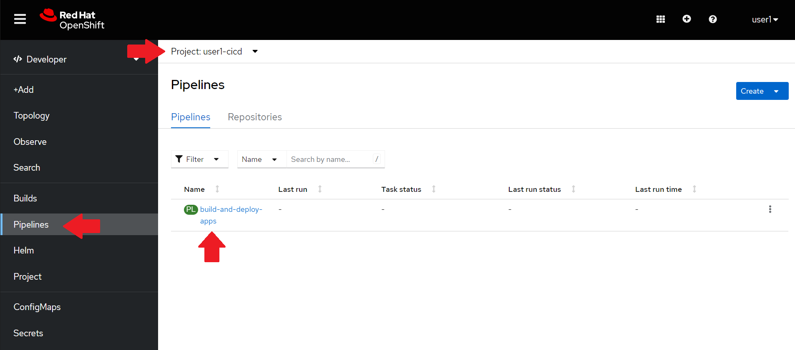

if you click on the *build-and-deploy-apps* link, you'll be able to see the pipeline steps.

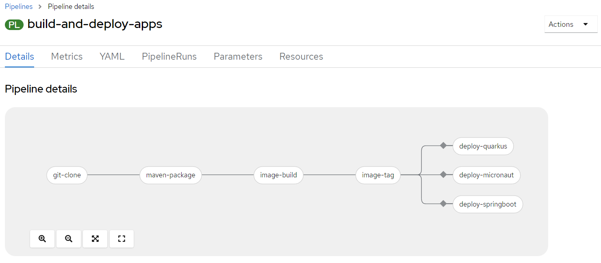

. Clone your source code from your fork.
. Build the Java code using Maven.
. Build and push the container image to Quay.io
. Tag the image as *latest*
. Deploy the application in your `%user%-staging` namespace.

[NOTE]
====
We'll be using the same pipeline to deploy all three applications, but we'll run it three times (one for each app).
====

== Configuring access to Quay.io

You need to create the image repositories in your https://quay.io/repository/[Quay.io] account and create credentials for the pipeline to be able to push the image.

First create 3 new repositories in your account: 

* *quarkus-app*
* *micronaut-app*
* *springboot-app*

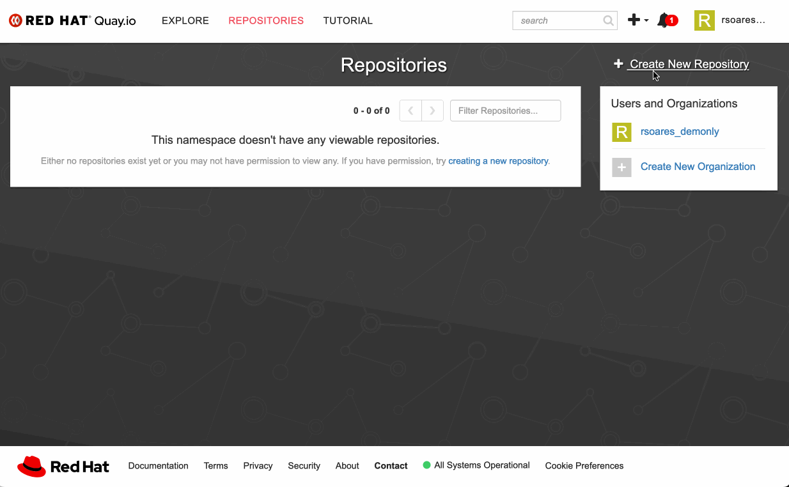

[WARNING]
====
To avoid problems, please use these exact same names for the repositories. Make sure they are public!

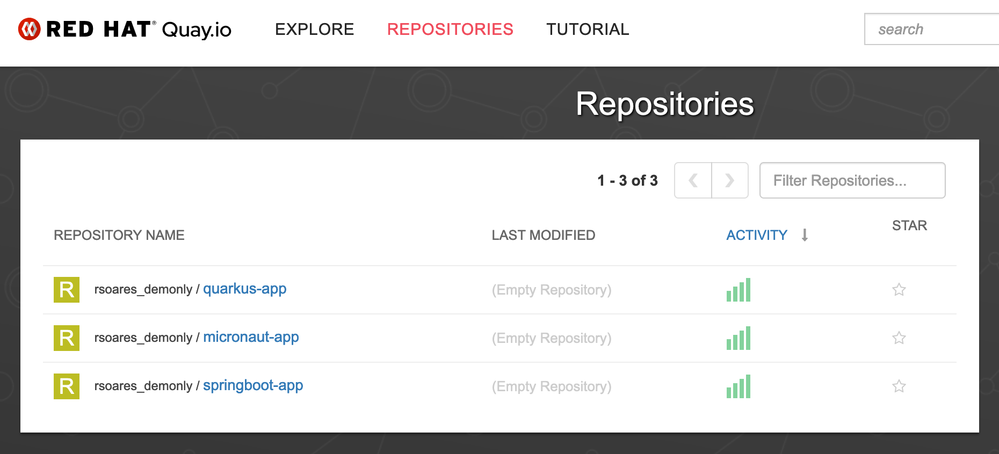
====

Once the 3 repositories are created, you can create a robot account. This robot account needs write permissions for the repositories. 

[#configuring-access-to-quay]
*Follow the steps in the following gif to set your robot account*: 

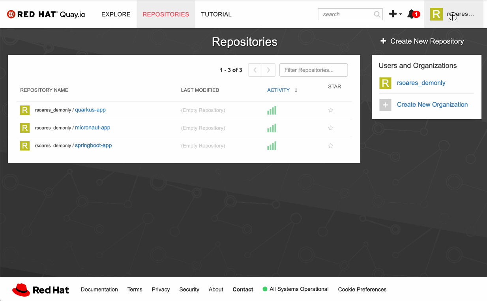

Once the robot is created, you can get the secret you need to authenticate the pipeline.

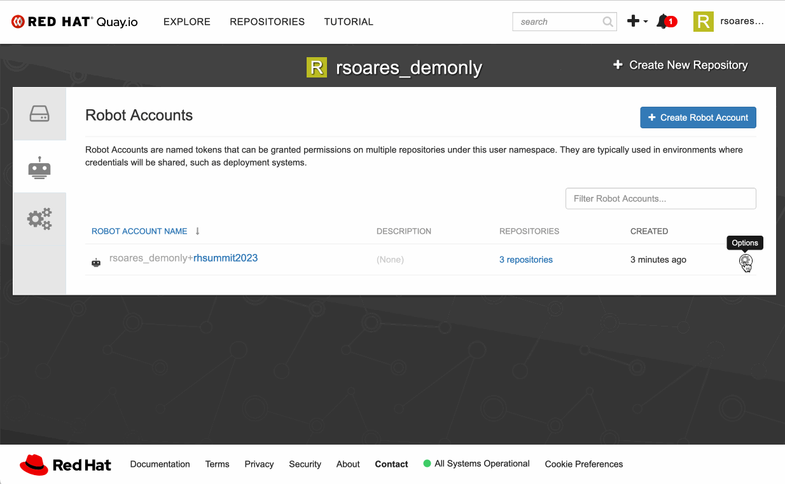

With the kubernetes secret's content in your clipboard you create a new Secret resource inside your `%user%-cicd` project namespace.

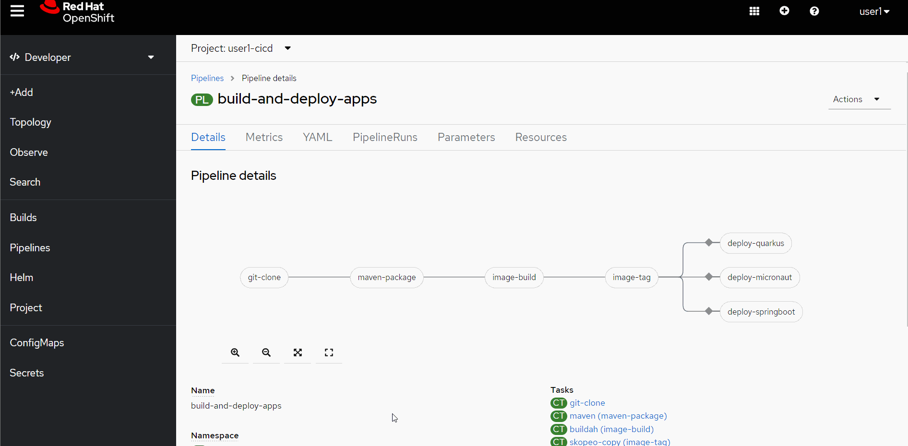

[IMPORTANT]
====
#As shown in the gif above make sure you change the *resource name* to `quay-secret` and set the *namespace* to  `%user%-cicd`!#
====

Before running the pipeline you need to link the secret you just created (containing your quay.io robot token) to the https://kubernetes.io/docs/concepts/security/service-accounts/[Service Account] used by the pipeline inside your project namespace.

You can easily do that using your link:{user_devworkspace_url}[DevWorkspace's] *Task Manager* by running the *Task* `Link Secret to Pipeline SA` as follows:

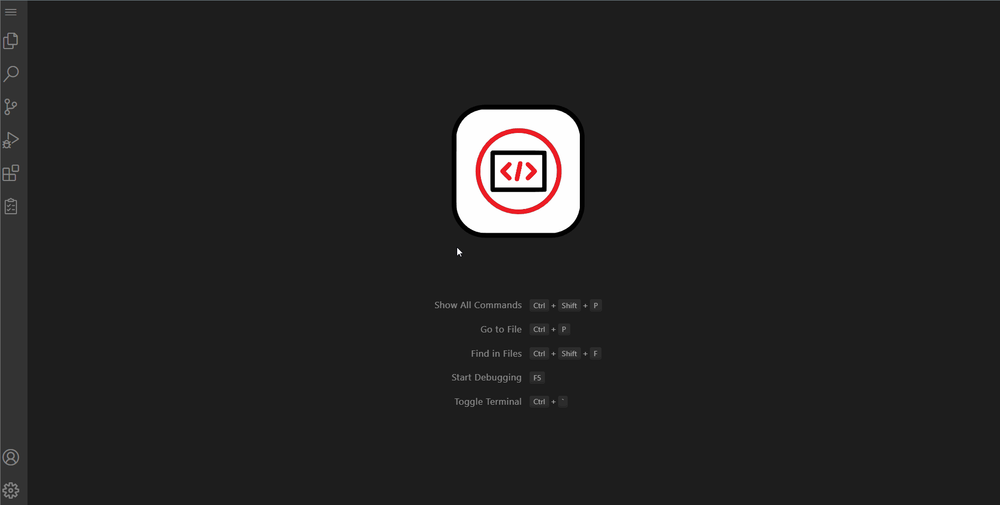

[TIP]
====
You can also link your secret to the pipeline Service Account using the `oc` CLI in the Terminal.

[source, shell, role=copy]
-----
oc secrets link pipeline quay-secret --for=pull,mount -n "%user%-cicd"
-----

To check the link use

[source, shell, role=copy]
-----
oc describe sa pipeline -n %user%-cicd
-----

Look for `Mountable secrets:` like bellow
[source]
-----
Name:                pipeline
Namespace:           %user%-cicd
Labels:              <none>
Annotations:         <none>
Image pull secrets:  pipeline-dockercfg-8dsk2
                     quay-secret
Mountable secrets:   pipeline-dockercfg-8dsk2
                     quay-secret
Tokens:              pipeline-token-ggfvh
Events:              <none>
-----

====

[#running-pipeline]
== Running the pipeline

Now you are ready to start your first *Pipeline Run*. 
Go back to the *Pipeline view* in the link:link:%openshift_console_url%/topology/ns/%user%-cicd[*Openshift Developer Console*]. Click on `Actions`, then click on `Start`.

Fill in the mandatory parameters:

* *git-url*: copy and paste your git repo URL - the one you created at the beginning from the Workshop Template.
* *app-name*: `quarkus-app` or `micronaut-app` or `springboot-app` (#pay attention to use exact app name, otherwise the pipeline run will fail!#)
* *registry-repo*: your (quay.io) account name
* leave all the others with the default values!

For the Workspaces section, select:

* #*shared-workspace*: select `PersistenceVolumeClaim`, then select `shared-workspace-pvc` from the list#
* *maven-settings*: leave as `Empty Directory`
* *img-urls-cm*: leave as `Empty Directory`

Click on `start` and wait for the pipeline to finish it's process.

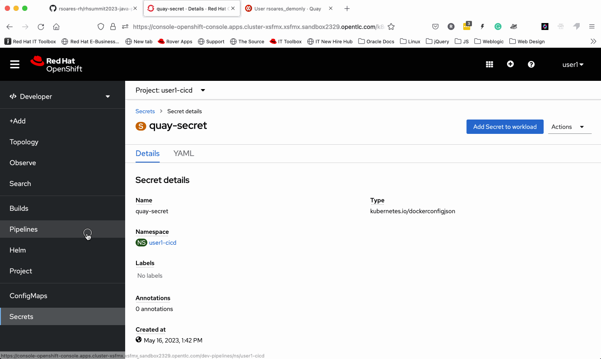

[TIP]
====
An easy and quick way to get your *git repo url* is to execute the following command in the DevWorkspace Terminal:

[source, shell, role=copy]
-----
git remote -v
-----

During the Pipeline Run execution you can follow its log live by opening the `Logs` view like this:

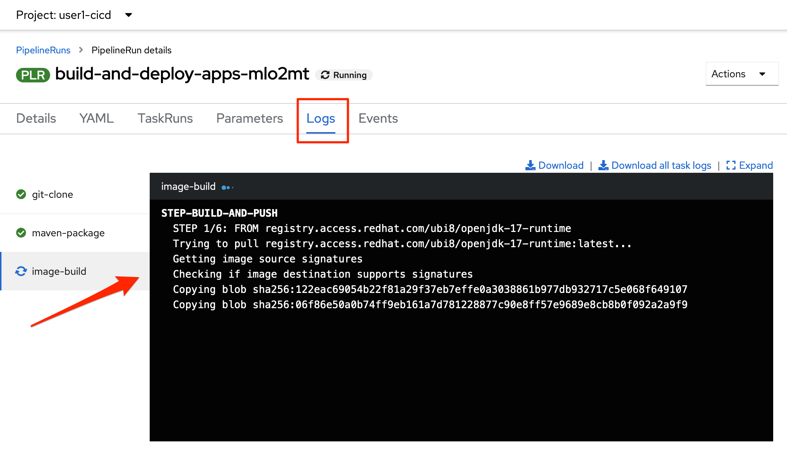
====

Once the pipeline finished successfully, all tasks on it will be green as in the following image:

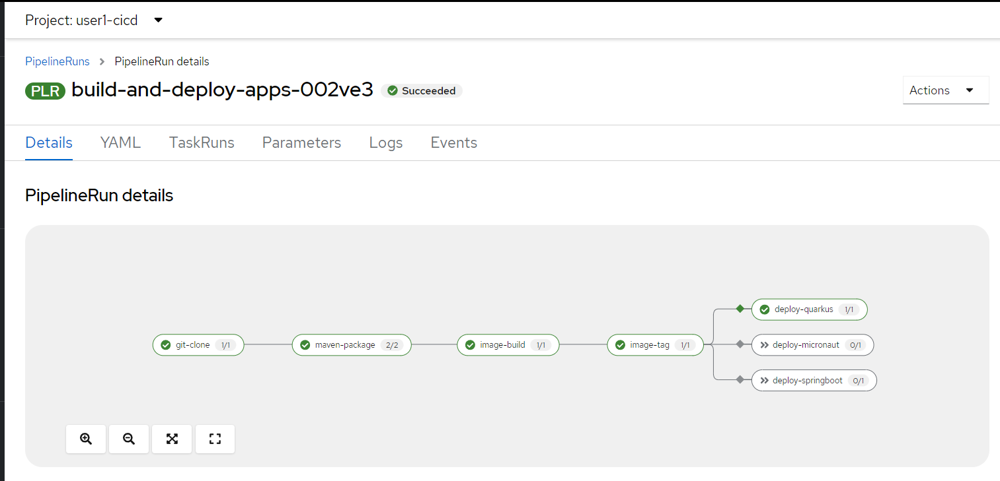

== Checking the deployment

Since we're deploying our apps as Serverless applications, after the initial deployment of the https://knative.dev/docs/concepts/serving-resources/revisions/[revision], if there is no requests (in a 30s time-frame), the application will scale down to zero.

To test if the deployment was successful, you can make a request to the application using its external https://docs.openshift.com/container-platform/4.12/networking/routes/route-configuration.html[Route].

Using the %openshift_console_url%[OpenShift console], go to the `%user%staging` project. In the topology view, click on the arrow icon in the quarkus application box:

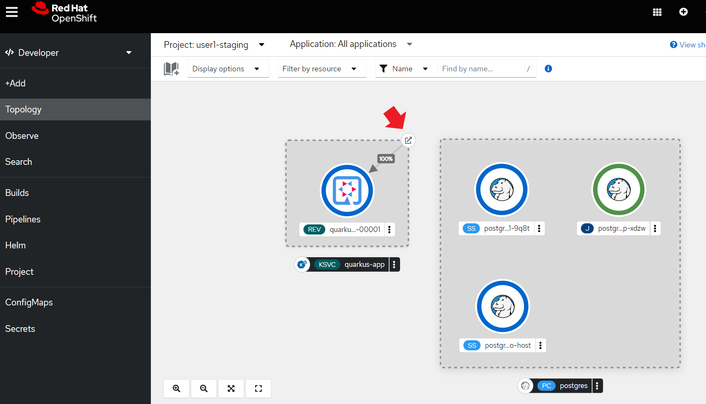

You should be able to visualize the Quarkus application home page, just like in the image:

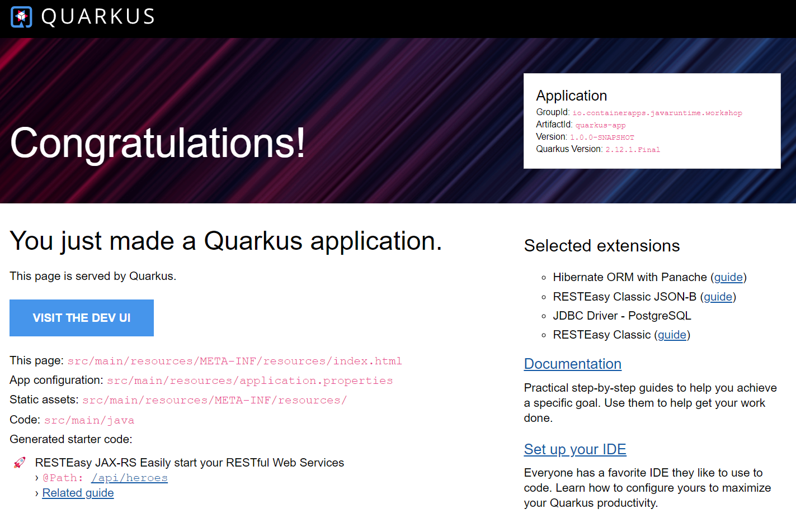

Now run the Pipeline again for the other two apps: *micronaut-app* and *springboot-app*!

[TIP]
====
To start a new *Pipeline Run*, in the link:%openshift_console_url%/topology/ns/%user%-cicd[*Openshift Developer Console*]:

 * make sure you are in the `%user%-cicd` project namespace  
 * click *Pipelines* in the left menu, then click on the `build-and-deploy-apps` Pipeline 
 * at the top left, click `Actions` and then `Start`
====

Once each Pipeline Run finishes successfully test them by accessing its external Route the same way you did for the *quarkus-app*.

After successfully executing the Pipeline for each app you should be able to see them by accessing the link:%openshift_console_url%/topology/ns/%user%-staging?view=graph[*Topology* view] of the Openshift Developer Console. Like this one:

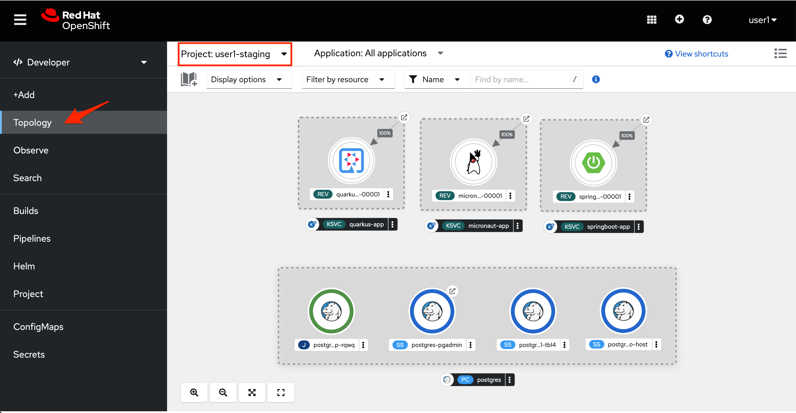

Now let's explore how to load test and observe our apps! 