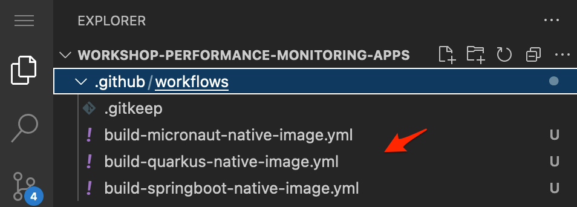
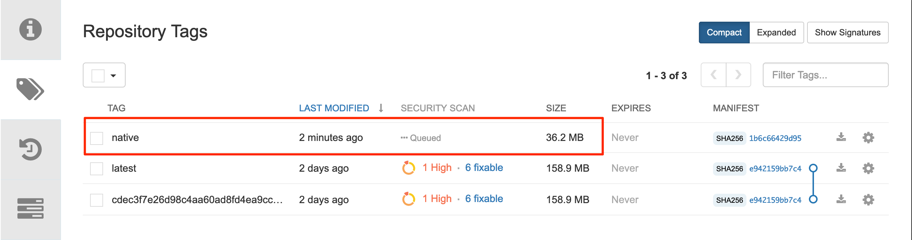
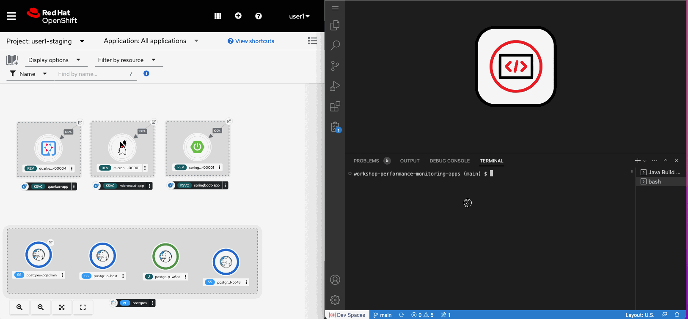
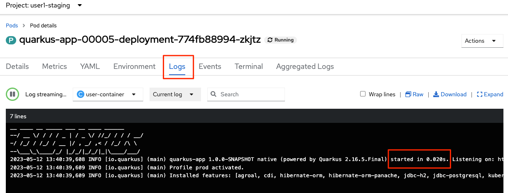

:guid: %guid%
:user: %user%

:openshift_user_password: %password%
:openshift_console_url: %openshift_console_url%
:user_devworkspace_url: https://devspaces.%openshift_cluster_ingress_domain%
:hyperfoil_web_cli_url: https://%user%-hyperfoil.%openshift_cluster_ingress_domain%
:hyperfoil_web_cli_url_auth_creds: https://%user%:%password%@%user%-hyperfoil.%openshift_cluster_ingress_domain%
:hyperfoil_benchmark_definition_url: https://raw.githubusercontent.com/redhat-na-ssa/workshop_performance-monitoring-apps-template/main/scripts/hyperfoil/summit-load-apps.hf.yaml
:grafana_url: https://grafana-route-grafana.%openshift_cluster_ingress_domain%
:pgadmin_url: https://pgadmin-%user%-staging.%openshift_cluster_ingress_domain%

:sectlinks:
:sectanchors:
:markup-in-source: verbatim,attributes,quotes

= Going Native

In this section you will:

* Learn what GraalVM is, and what is a native build
* Build a native image of your applications (optional)
* Update our application deployments to use the native image version
* Load test them

== What is GraalVM

GraalVM is a new technology, allowing for the creation of a native build of a Java application;
your application will be compiled to a native executable, and will not need a JVM to run.
That executable will be specific to your operating system, and will start much faster than with a JVM.

You can find more information on GraalVM at https://www.graalvm.org/[https://www.graalvm.org/]. 

[NOTE]
====
Red Hat provides downstream release of GraalVM called link:https://github.com/graalvm/mandrel[*Mandrel*], focused on native image compilation of *Java applications in Red Hat-backed projects*. As such, it is not a GraalVM native-image replacement for all users. For instance, Mandrel does not ship with polyglot or LLVM toolchain support, which some use cases might require. However, Red Hat engineers contribute to upstream GraalVM and work hard to stay up-to-date with upstream GraalVM code. 
For more details on Mandrel distribution and its use on Java Application (using Quarkus) checkout link:https://developers.redhat.com/blog/2021/04/14/mandrel-a-specialized-distribution-of-graalvm-for-quarkus[this article].
====

[NOTE]
====
Because native builds are much slower than JVM builds and are resource intensive (cpu and mem) we won't execute them in this Lab. 
There are guides showing how you can setup a GraalVM environment to create a native-executable for each of the modern cloud-native java runtimes we've been using in this Lab. 

For instance if you are interested in know how to create a native-executable for your Quarkus App link:https://quarkus.io/guides/building-native-image[checkout this guide in  Quarkus.io.]
====

== Building native image using Github Actions

[IMPORTANT]
====
#Again, due to our Lab session time constraint, we already built all the three apps' native images and made them available for you in our Quay.io Organization:#

[code]
----
quay.io/redhat_na_ssa/quarkus-app-native
quay.io/redhat_na_ssa/micronaut-app-native
quay.io/redhat_na_ssa/springboot-app-native
----

*Feel free to skip this build step and then go straight to the link:#updating-native-images[next section to update your service's deployment] pointing to our registry.*
====

To build native images of our 3 microservices, we will use a pre-configured link:https://docs.github.com/en/actions[*GitHub Action workflow*] already created for you inside your git repo.
There three workflow definitions inside `$PROJECT_SOURCE/.github/workflows`:

Each one can be used to manually trigger its respective application native image build using Github infrastructure. 
For instance, lets trigger the workflow to build a native image for our Quarkus app.

1. First you need to define two Github Secrets in your repo.
 ** from your github account, open our repo and click the `Settings` tab
 ** at the left menu open `Secrets and variables`, then `Actions`
 ** create a secret named `REGISTRY_USERNAME` (by clicking the `New repository secret` button)
  *** `*Name*`: `REGISTRY_USERNAME`
  *** `*Secret*`: #use the same *Robot account name* you set up early# (in the xref:../4-deploying-applications.adoc#configuring-access-to-quay[Configuring access to Quay.io] section)
 ** create another secret named `REGISTRY_TOKEN`
  *** `*Name*`: `REGISTRY_TOKEN`
  *** `*Secret*`: #use the same *Robot account token* you set up early# 
2. now, open our repo and click the `Actions` tab
3. in the left menu select the workflow `Build Quarkus native container image`
4. then at the far right click the `Run workflow` button.
5. fill in the field:
 ** `Container Registry Organization/Account name`: should be your personal quay.io account name
6. finally, click `Run workflow`

.*Click to see how to run a Github action workflow*
[%collapsible]
====
* Defining the secrets

image::../imgs/module-5/github_secret_actions.gif[Github Secrets]

* Running the build workflow

image::../imgs/module-5/github_action_native_build_trigger.gif[Github Action to build native images for our applications]
====

The workflow run should take about *8min or less* (depending on how health the Github infrastructure is at the moment you run). If it succeeds (your set up your registry secrets properly) you should have a new image pushed to your Quay.io.

[TIP]
====
You can start all three workflows in parallel if you will. 
====

[NOTE]
====
To keep it simple, our Github Actions are configured to push the native images to the same repository you created early when setting up the Build and Deploy CI/CD Pipeline. So, each app native image should be pushed to its corresponding repo in quay.io, but now tagged with '#native#' instead of `latest`, like:

* *quarkus-app*    - will be pushed to `quay.io/*your-account*/quarkus-app:native`
* *micronaut-app*  - will be pushed to `quay.io/*your-account*/micronaut-app:native`
* *springboot-app* - will be pushed to `quay.io/*your-account*/springboot-app:native`

====

Notice the size of our native container image! Compare it with the JVM based image.

Now, #how about the resource consumption at runtime?# To find that out lets update our apps' deployment and run some load tests to observe how it behaves compared to its JVM version...

[#updating-native-images]
=== Updating our application deployments to use the native container image
Because your apps are deployed as Serverless workload (based on Knative Serving) we'll be using the Knative CLI (`kn`) to update them.

==== Updating the Quarkus service
To update the Quarkus app deployment, open a Terminal in your DevWorkspace and run this command.

[source, shell, role=copy, subs=+quotes]
----
kn service update quarkus-app -n %user%-staging \
  --probe-liveness-opts='initialDelaySeconds=1' \
  --probe-readiness-opts='initialDelaySeconds=1' \
  --limit=cpu=1,memory=700Mi \
  --scale=0..5 \
  --image quay.io/redhat_na_ssa/quarkus-app-native # <=== YOU CAN REPLACE TO YOUR NATIVE IMAGE HERE

----

[TIP]
====
If you were able to successfully run the Github Action workflow and to want to use your own image here, *just remember to replace the `--image` param to point to your quay.io account*. For instance, to use you own quarkus native image use

[source, subs=+quotes]
-----
kn service update quarkus-app -n %user%-staging \
  --probe-liveness-opts='initialDelaySeconds=1' \
  --probe-readiness-opts='initialDelaySeconds=1' \
  --limit=cpu=1,memory=700Mi \
  --scale=0..5 \
  --image quay.io/*your-account*/quarkus-app:native #<=== here#
-----
====

.*Click to see how to execute the above `kn service update` from your DevWorkspace Terminal*
[%collapsible]
====

====

This command will update the app deployment pointing to the native image version of it. Notice we passed a couple of parameters to the `kn` to adjust some resource settings, like:

 * *heath check probes*
 * *cpu and mem limits*
 * *increase the replica scaling range* 

This is important as the native version of our app is *requires much less compute resource*. As a consequence we get much more deployment density when using native builds.

Notice for instance, the startup time of the native version of our *quarkus-app*. As you can see the app #*started in a sub-second (`0.020s` in my case) time!!!*#

*Among other benefits, such a small startup time makes Java native builds a great fit for Serverless use cases which requires fast startup times...* 

Now, go ahead and update the other two apps and observe the same aspects of this update.

==== Updating the Micronaut service
To update the Micronaut app deployment open a Terminal in your DevWorkspace and run this command.

[source, shell, role=copy, subs=+quotes]
----
kn service update micronaut-app -n %user%-staging \
  --probe-liveness-opts='initialDelaySeconds=1' \
  --probe-readiness-opts='initialDelaySeconds=1' \
  --limit=cpu=1,memory=700Mi \
  --scale=0..5 \
  --image quay.io/redhat_na_ssa/micronaut-app-native # <=== YOU CAN REPLACE TO YOUR NATIVE IMAGE HERE

----

==== Updating the Springboot service
To update the Springboot app deployment open a Terminal in your DevWorkspace and run this command.

[source, shell, role=copy, subs=+quotes]
----
kn service update springboot-app -n %user%-staging \
  --probe-liveness-opts='initialDelaySeconds=1' \
  --probe-readiness-opts='initialDelaySeconds=1' \
  --limit=cpu=1,memory=700Mi \
  --scale=0..5 \
  --image quay.io/redhat_na_ssa/springboot-app-native # <=== YOU CAN REPLACE TO YOUR NATIVE IMAGE HERE

----

== Load Testing the Native Images

After all your native images are built and deployed, let's run our load tests again.

Open the link:{hyperfoil_web_cli_url_auth_creds}[Hyperfoil Web CLI] and start new Test runs as described in the load testing section.

You can run the same load tests we ran the first time we introduce Hyperfoil Web CLI to you in the  xref:loadtesting.adoc#running-hyperfoil[load testing section].

== Monitoring the Native Images

While the load test is running, let's take a look at the results using link:{grafana_url}[Grafana].

You should now see the results of the load tests for the native images, and you can compare them to the previous results of the JVM images.

image::../imgs/module-5/grafana_workload_dashboards.gif[Grafana workload dashboard]
