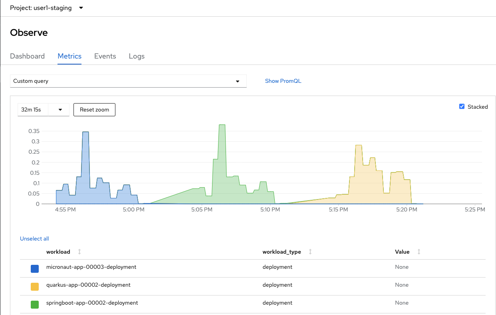

:guid: %guid%
:user: %user%

:openshift_user_password: %password%
:openshift_console_url: %openshift_console_url%
:user_devworkspace_url: https://devspaces.%openshift_cluster_ingress_domain%
:hyperfoil_web_cli_url: https://%user%-hyperfoil.%openshift_cluster_ingress_domain%
:hyperfoil_web_cli_url_auth_creds: https://%user%:%password%@%user%-hyperfoil.%openshift_cluster_ingress_domain%
:hyperfoil_benchmark_definition_url: https://raw.githubusercontent.com/redhat-na-ssa/workshop_performance-monitoring-apps-template/main/scripts/hyperfoil/summit-load-apps.hf.yaml
:grafana_url: https://grafana-route-grafana.%openshift_cluster_ingress_domain%
:pgadmin_url: https://pgadmin-%user%-staging.%openshift_cluster_ingress_domain%

:openshift_observe_cpu_promoql_url: %openshift_console_url%/dev-monitoring/ns/%user%-staging/metrics?query0=sum%28%0A++node_namespace_pod_container%3Acontainer_cpu_usage_seconds_total%3Asum_irate%7Bcluster%3D%22%22%2C+namespace%3D%22%user%-staging%22%7D%0A*+on%28namespace%2Cpod%29%0A++group_left%28workload%2C+workload_type%29+namespace_workload_pod%3Akube_pod_owner%3Arelabel%7Bcluster%3D%22%22%2C+namespace%3D%22%user%-staging%22%2C+workload_type%3D%22deployment%22%7D%0A%29+by+%28workload%2C+workload_type%29%0A&query1=scalar%28kube_resourcequota%7Bcluster%3D%22%22%2C+namespace%3D%22%user%-staging%22%2C+type%3D%22hard%22%2Cresource%3D%22requests.cpu%22%7D%29&query2=scalar%28kube_resourcequota%7Bcluster%3D%22%22%2C+namespace%3D%22%user%-staging%22%2C+type%3D%22hard%22%2Cresource%3D%22limits.cpu%22%7D%29

:openshift_observe_memory_promoql_url: %openshift_console_url%/dev-monitoring/ns/%user%-staging/metrics?query0=sum%28%0A++++container_memory_working_set_bytes%7Bjob%3D%22kubelet%22%2C+metrics_path%3D%22%2Fmetrics%2Fcadvisor%22%2C+cluster%3D%22%22%2C+namespace%3D%22%user%-staging%22%2C+container%21%3D%22%22%2C+image%21%3D%22%22%7D%0A++*+on%28namespace%2Cpod%29%0A++++group_left%28workload%2C+workload_type%29+namespace_workload_pod%3Akube_pod_owner%3Arelabel%7Bcluster%3D%22%22%2C+namespace%3D%22%user%-staging%22%2C+workload_type%3D%22deployment%22%7D%0A%29+by+%28workload%2C+workload_type%29%0A&query1=scalar%28kube_resourcequota%7Bcluster%3D%22%22%2C+namespace%3D%22%user%-staging%22%2C+type%3D%22hard%22%2Cresource%3D%22requests.memory%22%7D%29&query2=scalar%28kube_resourcequota%7Bcluster%3D%22%22%2C+namespace%3D%22%user%-staging%22%2C+type%3D%22hard%22%2Cresource%3D%22limits.memory%22%7D%29

:markup-in-source: verbatim,attributes,quotes
:source-highlighter: highlight.js
:sectlinks:
:sectanchors:

= Load Testing

Now that we have our apps built and deployed to our staging environment, it's time to add some load to them.
For the purpose of our Lab this will allow us to see two things:

1. observe resource consumption metrics (CPU, memory, networking traffic, etc) for each app container.
2. how the auto-scaling feature works when using Openshift Serverless deployment mode.

== Introducing Hyperfoil Load Driver

Nowadays, there are many opensource tools that can be used to generate application load towards your applications. 
Many of these tools were designed before Containers and Kubernetes making their deployment, configuration and scalability a challenge considering the distributed nature of Kubernetes. 

For this Lab we will be using a tool called link:https://hyperfoil.io[Hyperfoil.io^]. Hyperfoil is described as a *Microservice-oriented distributed benchmark framework*.
Because Hyperfoil is kubernetes-native, it's perfect for our use-case as it is easy to deploy and run on any Kubernetes environment.

[TIP]
====
Hyperfoil is a powerful and flexible (kubernetes-native) *Load Driver* tool that can be applied to very robust use-cases. It was initially developed by the Red Hat Engineering team to test
our own Software but is now available as an link:https://github.com/Hyperfoil/Hyperfoil[opensource project^] for anyone to use and contribute.

To see more details around the motivation and purpose of this tool, please see its link:https://hyperfoil.io/docs[Documentation here^]
====

=== Hyperfoil Architecture
As mentioned early in its nature Hyperfoil is a distributed tool with link:https://martinfowler.com/articles/patterns-of-distributed-systems/leader-follower.html[leader-follower architecture^]. The 
*Controller* has the leader role; this is a link:https://vertx.io/[Vert.x-based^] server with REST API. 
When a *benchmark* is started the Controller deploys *Agents* (according to the benchmark definition), pushes the benchmark definition to these agents and orchestrates benchmark *
*. 
Agents execute the benchmark, periodically sending statistics to the Controller. 
This way the Controller can combine and evaluate statistics from all agents on the fly. When the benchmark is completed all Agents terminate.

In order to run a load testing using Hyperfoil we need to create a link:https://hyperfoil.io/userguide/benchmark.html[Benchmark^]. In Hyperfoil terms a Benchmark is a declarative YAML file where you define
your load test Scenario. Lets take a look at one snippet of the 
link:{hyperfoil_benchmark_definition_url}[benchmark definition] 
we'll be using thought this section of our Lab.

[source, yaml]
----
# This is the name of the benchmark. It's recommended to keep this in sync with
# name of this file, adding extension `.hf.yaml`.
name: summit-lab-load-apps
# We must define at least one HTTP target, in this case it becomes a default
# for all HTTP requests.
http:
- host: http://quarkus-app:8080

# Distribute the connections among two agents
agents:
  agent-01:
    node: kubernetes.io/os=linux # you can use labels to select nodes
  #... define many agents as you may need

# Simulation consists of phases - potentially independent workloads.
# all phases are started independently at the same moment (when the benchmark was started)
phases:
# `wakeUp` is the name of the 1st phase in this benchmark.
- wakeUp:
    # The benchmark will start certain number of users according to a schedule 
    # regardless of previously started users completing the scenario. 
    # This is the open-model
    atOnce:
      users: 1 # run the scenario exactly once
      scenario:
      - serviceWakeup: # the only sequence for this scenario
        # In the only step in this sequence we'll do a HTTP GET request
        # Steps are the basic building blocks that form each sequence of a scenario, 
        # similar to statements in a programming language. 
        # steps are potentially blocking (the sequence cannot continue with next step until previous one finishes).
        - httpRequest:
            GET: /quarkus
            # Inject helpers to make this request synchronous, i.e. keep
            # the sequence blocked until Hyperfoil processes the response.
            sync: true

# 2nd phase of this benchmark
- hello:
    constantRate:
      #will wait until the wakeUp phase is TERMINATED (all requests done!)
      startAfterStrict: wakeUp
      # 10 users will be starting the scenario every second (during 120s)
      usersPerSec: 10 # run the scenario 'n' times per second in average
      duration: 180s #let it run for about 3min...
      # In Hyperfoil, everything is pre-allocated = limited in size. Here we'll
      # set that we won't run more than LOOP (1 by default) iterations of this phase.
      # maxIterations: !param LOOP 1
      scenario:
      - sayHello: #sequence
        - httpRequest:
            GET: !param APP_CONTEXT_PATH
            endpoint: app-host
        # Wait 3 seconds to simulate user-interaction
        - thinkTime:
            duration: 300 ms
#...
----

The benchmark used in our lab defines the following structure:

 * *3 agents*
 * *A scenario with 6 phases*

  1. `wakeUp`: single request to the app main endpoint
  2. `hello`: 10 virtual users at constant rate hitting the main endpoint
  3. `cpuRampUp`: increasing rate (1..10) virtual users hitting the `/cpu` endpoint to generate cpu load
  4. `cpuWithPersistence`: same as `cpuRampUp` but persisting result to a DB
  5. `memoryRampUp`: increasing rate (1..10) virtual users hitting the `/memory` endpoint to generate cpu load
  6. `memoryWithPersistence`: same as `memoryRampUp` but persisting result to a DB

[NOTE]
====
The full benchmark definition can be found inside the lab repo: `$PROJECT_SOURCE/main/scripts/hyperfoil/summit-load-apps.hf.yaml`. 
====

[TIP]
====
The inline comments in the above benchmark snippet give us a glimpse of what each property means. 
To better understand the basic concepts of Hyperfoil we recommend reading though the following sections of the in the Project Documentation:

 * link:https://hyperfoil.io/quickstart/quickstart1.html[Getting started: First benchmark]
 * link:https://hyperfoil.io/docs/concepts.html[Concepts]
 * link:https://hyperfoil.io/userguide/benchmark.html[Benchmark definition format]
 * link:https://hyperfoil.io/docs/reference_index.html[steps and handlers used in a scenario]
 * link:https://hyperfoil.io/userguide/examples.html[Complex Benchmark definition samples]
====

[#running-hyperfoil]
=== Running a Hyperfoil Benchmark

To execute a Benchmark you need to connect to the *Hyperfoil Controller*. We already deployed one Hyperfoil instance for you
in  the `{user}-hyperfoil` project namespace. You can access it using its link:{hyperfoil_web_cli_url_auth_creds}[Web CLI]. 

From the Web CLI you can upload our benchmark and start running it to generate load towards your apps.
Follow the following steps:

1. Inside the Web CLI type `upload` and hit `Enter`. 

2. Click inside the `Input Text` field that appears in the console.
3. Copy this URL: `{hyperfoil_benchmark_definition_url}`
4. paste the URL into the text box and click `Upload from URL`.

.*Click to see how to upload our Benchmark in the Hyperfoil Web CLI*
[%collapsible]
====
image::../imgs/module-5/hyperfoil-web-cli-upload.gif[Screenshot of Hyperfoil Web CLI - uploading a benchmark definition,align=center]
====

Once you have the benchmark file uploaded to the Controller you can see some parameters that are specific to our definition. 

[source, shell]
----
Loaded benchmark template summit-lab-load-apps with these parameters (with defaults): 
NAME                 DEFAULT             CURRENT (CONTEXT)
SHARED_CONN          200                 (not set)        
CPU_ITERATIONS       5                   (not set)        
APP_CONTEXT_PATH     (no default value)  (not set)        
MEMORY_BITES         20                  (not set)        
USERS_PER_SEC        10                  (not set)        
APP_URL              (no default value)  (not set)        
PHASE_DURATION_SECS  120s                (not set)        
Uploading...
Benchmark summit-lab-load-apps uploaded.
----

[TIP]
====
 you don't have to make any change to the benchmark definition. But if you need to (or just want to see its definition) you can open it right from the Web CLI using an embedded editor. To do that just type `edit summit-lab-load-apps` in the Web CLI as shown in the screenshot. 
====

Now you ca start your first `run` by just executing:

[source, shell, role=copy]
----
run summit-lab-load-apps -PAPP_URL=http://quarkus-app.%user%-staging.svc.cluster.local -PAPP_CONTEXT_PATH=/quarkus 
----

[NOTE]
====
The params `APP_URL` and `APP_CONTEXT_PATH` are both required to run our benchmark definition.

 * the first one is the application URI. Here we are using the internal Kubernetes cluster service URI, but you can use the Openshift external Ingress Route as well.
 * the second one is the context path of the application (eg. `/quarkus` for the `quakus-app`)
====

[IMPORTANT]
====
To accommodate all users in our Lab cluster we set *resource quotas* that limits the number of PODs you can run simultaneously.

#PLEASE execute just one _Benchmark Run_ at a time!# Otherwise you can hit the resource quota and start getting some errors.
====

When you start a test `run` a few things happens:

1. the *Controller* starts the *Agents*
2. the agents registers against the Controller.
3. each Agent gets the test Scenario and start running its Phases as defined in the benchmark.
4. as the `run` goes each agent continually report various stats to the Controller.
+
NOTE: Eventually an agent may get overwhelmed (run out of resource for various reasons) and the `run` may get interrupted.
That's when you have to adjust your test scenario accordingly to your resources and application capacity. 
Hyperfoil offers many ways to fine tune your test scenario.
+
5. when the Test Scenario and all active the sessions (connections) are finished, the agents stops automatically.

The screenshot bellow show how to start a benchmark `run` against the  `quarkus-app`.

image::../imgs/module-5/hyperfoil-web-cli-run.gif[Screenshot of Hyperfoil Web CLI - running a benchmark against the quarkus-app,align=center]

[NOTE]
====
From the screenshot above we can observe a few things:

1. Three agents get started. You can see their PODs running on the Openshift Console (select the `{user}-hyperfoil` project namespace) using the *Topology* view in the Developer perspective.
2. The `quarkus-app` POD starts to handle the http traffic generated by the test run. In the Openshift Console you can see it by switching to the `{user}-staging` project namespace and using the the *Topology* view in the Developer perspective.
3. During the test `run` you can hit some keys to follow various stats of the current run:

 * `s` to see status
 * `t` to see stats of current phase(s)
 * `e` to see current session(s)
 * `c` to see current connections
 * `esc` to detach from the current `run`. When detached you can use the command `runs` to see all the current runs

====

After about 6min the test run gets finished and you should see a summary like the following showing the stats for each *test phase*.

You can also drill down and see more details of each test run. For instance to see detailed metrics of each phase executed, use the `stats 0001` command in the Web CLI (`0001` is the `RunId`, yours may be different).

[TIP]
====
to get a list of all Test runs use the `runs` command.
====

Lastly, but not least you can get a very detailed (html) report by executing the `report 0001` command in the Web CLI (`0001` is the `RunId`, yours may be different). 
Hyperfoil will generate a nice html report that gets automatically downloaded though your web browser.

Now that you know how to execute (and inspect) your benchmark inside the Hyperfoil Web CLI, run it against the `micronaut-app` and the `springboot-app`.

To run against the *micronaut-app* use:

[source,shell,role=copy,subs=attributes]
----
run summit-lab-load-apps -PAPP_URL=http://micronaut-app.{user}-staging.svc.cluster.local -PAPP_CONTEXT_PATH=/micronaut
----

To run against the *springboot-app* use:

[source,shell,role=copy,subs=attributes]
----
run summit-lab-load-apps -PAPP_URL=http://springboot-app.{user}-staging.svc.cluster.local -PAPP_CONTEXT_PATH=/springboot
----

[TIP]
====
#Okay, now is a great moment to Observe our apps by using the Openshift Monitoring capabilities!# 

While the Benchmark is running we encourage you to go to the Openshift Developer Console and open the link:{openshift_observe_cpu_promoql_url}[*Observe Metrics view*] for the *{user}-staging* project namespace. Also, go to link:{grafana_url}[Grafana console] to see some dashboards.

Now you should be able to not only visualize different metric data for each app but more importantly compare the resource usage between them!

For instance this Graph show the *CPU usage* for the three apps after executing our Benchmark for each one of them.

====

[NOTE]
====
By default each `phase` should last for *~1min* (`PHASE_DURATION_SECS` parameter defaults to `60s`). 
Because some phases run in parallel the total time of our test run may be around *3min*.
====

== Scaling

Our Openshift Cluster has the *Serverless capability* enabled, as such, our applications are deployed as Serverless workloads leveraging all the
link:https://docs.openshift.com/container-platform/4.12/serverless/about/about-knative-serving.html[Knative Serving features^] like link:https://docs.openshift.com/container-platform/4.12/serverless/knative-serving/autoscaling/serverless-autoscaling-developer.html[scale-to-zero] (when not serving http requests) and link:https://docs.openshift.com/container-platform/4.12/serverless/knative-serving/autoscaling/serverless-autoscaling-developer.html[auto-scaling] (to meet the concurrency demand).

So far we generated a small traffic using our load test driver (Hyperfoil), just enough to generate some resource consumption metrics.
Now let's generate a bit more load and see how our apps behave concerning the *Serverless auto-scaling* capability.

Openshift supports different types of POD Scaling that can be applied depending on the workload use-case.

 * The default POD Scaling mechanisms for Openshift Serverless workloads are:
  - based on link:https://docs.openshift.com/container-platform/4.12/serverless/knative-serving/autoscaling/serverless-autoscaling-developer.html[http concurrency] for *Knative Serving* based services.
  - based on link:https://docs.openshift.com/container-platform/4.12/serverless/eventing/triggers/serverless-triggers.html[Event triggers] for *Knative Eventing* based services.
 * The default Kubernetes link:https://docs.openshift.com/container-platform/4.12/nodes/pods/nodes-pods-autoscaling.html[*Horizontal POD Autoscaler (HPA)*] supports scaling based on the amount of *CPU* or *memory* consumed by a replica.
 * Custom scaling mechanism are also supported by using the link:https://docs.openshift.com/container-platform/4.12/nodes/pods/nodes-pods-autoscaling-custom.html[*Custom Metrics Autoscaler Operator*] based on link:https://keda.sh[KEDA Project].

[NOTE]
====
When you deployed the apps by running our Pipeline, each app was set to scale from 0 to 3 replicas. 
The default scaling rule for Knative Serving uses HTTP concurrency scaling and defaults to a _soft limit of_ `100` concurrent requests (configurable).
====

As each of our applications define endpoints to load either the CPU or the memory, we will explore usage of the _CPU_ and _Memory usage_ 
triggers to scale our application using the native Kubernetes HPA capability.

=== Scaling based on CPU usage

To scale based on CPU usage, we need to update the scale rule of each application to use the standard HPA scaling class and set it to use `cpu` metric as trigger.
This will create a new revision for the application (its original URL `http://quarkus-app-%user%-staging.%openshift_cluster_ingress_domain%` remains unchanged).

To do this change use the *Task* named `11: Enable CPU based auto-scaling` in your DevWorkspace *Task Manager*. 

For instance, the following screencast show how to enable auto-scaling based on *CPU* usage for our Quarkus app:

[TIP]
====
Alternatively you can execute the script manually from inside your DevWorkspce Terminal:

[source,shell,role=copy]
----
$PROJECT_SOURCE/scripts/enable-auto-scaling.sh cpu 20
----

The script uses the `kn` CLI to update the service deployed in your `{user}-staging` project namespace.
====

This will automatically scale out the application *when the CPU usage is above 20%* (we set it low deliberately to make it easy to go up).

To see the auto-scaling in action we need to generate some load towards our app. 

So, go back to the link:{hyperfoil_web_cli_url}[Hyperfoil Web CLI]
and start a new test run against one of our apps but now increasing the number of CPU iterations (using the `CPU_ITERATIONS` benchmark param):

[source,shell,role=copy,subs=attributes]
----
run summit-lab-load-apps -PCPU_ITERATIONS=35 -PAPP_URL=http://quarkus-app.{user}-staging.svc.cluster.local -PAPP_CONTEXT_PATH=/quarkus
----

After a couple of minutes (~4min) you should be able to watch the `quarkus-app` automatically scaling from 1 to 3 replicas.

While the benchmark is running open the Openshift Developer Console link:%openshift_console_url%/topology/ns/%user%-staging?view=graph[*Topology view*] and click on the Quarkus POD and watch the number of replicas scale up to 3. 

You can also notice an increase on the *CPU usage* by looking at the link:{openshift_observe_cpu_promoql_url}[*Observe Metrics view*].

image::../imgs/module-5/hyperfoil-web-cli-test-cpu-load-autoscaling-trigger.gif[Screenshot of Hyperfoil - CPU based auto-scaling test run]

[NOTE]
====
After a couple of minutes (~6min) without load or traffic the app should be scaled down to `1` replica.
Because we switched our app to use cpu-based scaling metric (based on Kubernetes HPA mechanism) it will 
have a minimum of `1` replica instead of zero (default when using Knative POD Autoscaling - KPA).

#You don't need to wait for the scale-down. Go ahead with the next section!#
====

=== Scaling based on memory usage

Another option that we can use is to scale based on the memory usage, with the `memory` trigger.

This time lets set the scale rule for our Micronaut app using the Task `12: Enable memory based auto-scaling` in your DevWorkspace:

[TIP]
====
If preferred you execute the script manually from inside your DevWorkspce Terminal:

[source,shell,role=copy]
----
$PROJECT_SOURCE/scripts/enable-auto-scaling.sh memory 400
----

The script uses the `kn` CLI to update the service deployed in your `{user}-staging` project namespace.
====

This will automatically scale out the application *when the memory usage is above 400Mb* (we set it low deliberately to make it easy to go up).

If you open the Openshift Console, Topology view and look at the Micronaut app you should a see a new revision (`00002` in my case) reflecting the new scaling setting.

Now, go back to the link:{hyperfoil_web_cli_url_auth_creds}[Hyperfoil Web CLI] and start a new test run against the *Micronaut app*, but now increasing the number of Memory Bites to be consumed by each request (using the `MEMORY_BITES` benchmark param):

[source,shell,role=copy,subs=attributes]
----
run summit-lab-load-apps -PMEMORY_BITES=50 -PCPU_ITERATIONS=5 -PAPP_URL=http://micronaut-app.{user}-staging.svc.cluster.local -PAPP_CONTEXT_PATH=/micronaut
----

After a couple of minutes (~4min) you should be able to watch the `micronaut-app` automatically scaling from 1 to 3 replicas.

While the benchmark is running open the Openshift Developer Console link:%openshift_console_url%/topology/ns/%user%-staging?view=graph[*Topology view*] and click on the Micronaut POD and watch the number of replicas scale up to 3. 

You can also notice an increase on the *memory usage* by looking at the link:{openshift_observe_memory_promoql_url}[*Observe Metrics view*].

image::../imgs/module-5/hyperfoil-web-cli-test-memory-load-autoscaling-trigger.gif[Screenshot of Hyperfoil - memory based auto-scaling test run]

Now lets visualize a different graph consolidating all the three metrics: CPU usage, memory usage and number of POD replicas. For this we will use Grafana.

link:{grafana_url}[Open Grafana] and select the `App Performance` Dashboard. Look at the `# Replicas` graph (bellow `Max CPU usage`), 
see the number of replicas for the Micronaut app right after this last test run. 

#Before we move on to our final test run, lets switch the Micronaut service deployment back to the default scale rule so it can scale down to zero and save some resources in our cluster.# Using the Terminal inside your DevWorkspace execute:

[source, shell, role=copy]
----
kn service update micronaut-app -n %user%-staging \
 --annotation autoscaling.knative.dev/class=kpa.autoscaling.knative.dev \
 --scale-metric=concurrency \
 --scale-utilization=10 \
 --no-wait
----

Now, go ahead and execute another test run towards the *Springboot app*. For the Springboot app we'll use the default auto-scaling rule which is based on the http concurrency. 

Before we start the test run lets set a threshold of 10 concurrent requests per POD deliberately to make it easy to go up. Using the DevWorkspace Terminal execute the following command to update the Springboot service deployment:

[source, shell, role=copy]
----
kn service update springboot-app -n %user%-staging \
 --scale-metric=concurrency \
 --concurrency-limit=10 \
 --no-wait
----

A new service revision will be created to reflect this update.

Now from the Hyperfoil Web CLI start a new test run, but now increasing the number of Virtual Users (using the `USERS_PER_SEC` benchmark param):

[source,shell,role=copy,subs=attributes]
----
run summit-lab-load-apps -PUSERS_PER_SEC=60 -PMEMORY_BITES=20 -PCPU_ITERATIONS=5 -PAPP_URL=http://springboot-app.{user}-staging.svc.cluster.local -PAPP_CONTEXT_PATH=/springboot
----

While the Benchmark is running go to link:{grafana_url}[Grafana console] and open the Dashboard named *App Performance* to see how the metrics *CPU usage*, *memory usage* and *# of replicas* plays for each application during these three load tests we just ran. 

You can now compare how the CPU (Quarkus), memory (Micronaut), and HTTP (Spring) triggers behave when scaling the application, under the similar load. 

As you can see, using different scaling triggers allows to tune the scaling behavior of your application, depending on the type of load you want to handle.

Note that you're not limited to only one scaling trigger, you can use multiple triggers at the same time.

[TIP]
====
Fine tuning the scaling rules is a key factor to get the best performance/cost ratio for your application.
You want to make sure that you don't scale too early, and that you don't scale too much to avoid paying for resources that are not needed.
====

== Checking the Metrics in the Database
Remember that we have a PostgreSQL Database with three tables where we store our metrics. You can execute the following SQL statements so you get all the metrics for Quarkus, Micronaut and Spring Boot.

To query our Postgres DB instance we're going to use a tool called pgAdmin is provisioned by the CrunchyData Operator. Open the link:{pgadmin_url}[pgAdmin console] and use the following credentials:

 * username: `postgres@pgo`
 * password: `password`

select the `postgres` database and open the Query Tool to execute the following SQL queries.

[source,sql,role=copy]
----
select 
  to_char( (Duration/1e9), '''0.999''' ), 
  Parameter, 
  Description 
from Statistics_Quarkus
order by Duration DESC;
----

[source,sql,role=copy]
----
select 
  to_char( (Duration/1e9), '''0.999''' ), 
  Parameter, 
  Description 
from Statistics_Micronaut
order by Duration DESC;
----

[source,sql,role=copy]
----
select 
  to_char( (Duration/1e9), '''0.999''' ), 
  Parameter, 
  Description 
from Statistics_Springboot
order by Duration DESC;
----

