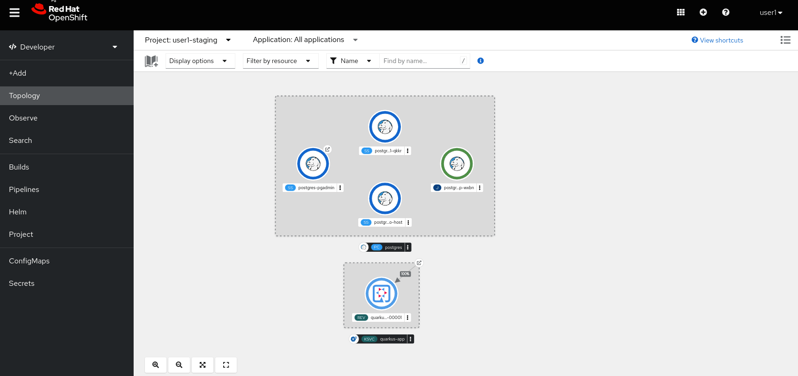
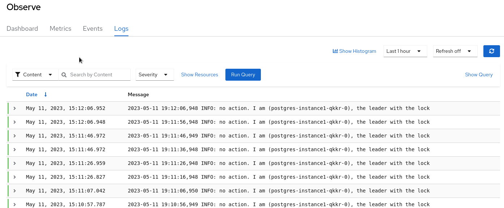
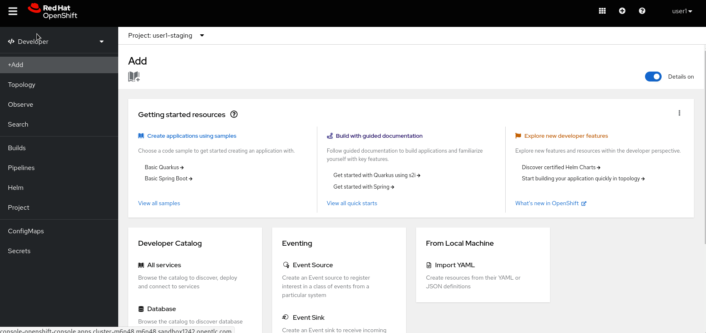

:guid: %guid%
:user: %user%

:openshift_user_password: %password%
:openshift_console_url: %openshift_console_url%
:openshift_cluster_ingress_domain: %openshift_cluster_ingress_domain%
:user_devworkspace_url: https://devspaces.%openshift_cluster_ingress_domain%
:hyperfoil_web_cli_url: https://%user%-hyperfoil.%openshift_cluster_ingress_domain%
:hyperfoil_web_cli_url_auth_creds: https://%user%:%password%@%user%-hyperfoil.%openshift_cluster_ingress_domain%
:hyperfoil_benchmark_definition_url: 'https://raw.githubusercontent.com/redhat-na-ssa/workshop_performance-monitoring-apps-template/main/scripts/hyperfoil/summit-load-apps.hf.yaml'
:grafana_url: https://grafana-route-grafana.%openshift_cluster_ingress_domain%

:sectlinks:
:sectanchors:
:markup-in-source: verbatim,attributes,quotes
:source-highlighter: highlight.js

= Load Testing, Scaling and Monitoring the Applications

== Logs

Red Hat Openshift provides two alternatives for customers looking for logging aggregation solutions: 

- Based on *Elasticsearch, Fluentd and Kibana*: With this solution all logs are streamed from the nodes by Fluentd to Elasticsearch, which in turn stores and index them. Kibana is shipped to visualize the logs. 
- link:https://grafana.com/oss/loki[*Grafana Loki*] is also provided as an alternative to EFK. Loki is a horizontally scalable, highly available, multi-tenant log aggregation system. While Elasticsearch indexes incoming log records completely during ingestion, Loki only indexes a few fixed labels during ingestion, and defers more complex parsing until after the logs have been stored. This means Loki can collect logs more quickly. As with Elasticsearch, you can query Loki using JSON paths or regular expressions. 

This environment is installed with *Grafana Loki* as the logging aggregation tool. 

With Loki the application logs are available directly from the OpenShift Console. It provides a nice interface to view the logs of your application. This is crucial to troubleshoot issues when something goes wrong. You have multiple options to view the application logs:

- You can connect to a given pod and see the logs of that specific pod. This is useful to troubleshoot issues with a specific instance of your application. Logs are available at the `Aggregated Logs` tab in the pod view.

[TIP]
====
Don't forget that by default, containers apps scale out to 0 instances when they are not used.
You can use the command `curl https://quarkus-app-{user}-staging.{openshift_cluster_ingress_domain}` or access it directly in your broswer to wake up the container app first if the connections fails.
====

- You can also access the console logs by using the `Observe` menu item, tab `Logs`:

On `Observe` menu item you can check logs of all namespaces you have access to. In this screen you can filter the logs by message content, pods, containers and severity:

- You may also follow the logs stream in real time from the tab `Logs` of pod screen.

OpenShift Logging is very useful to troubleshoot issues with more complex applications and find out application issues.

=== Querying your Application Logs
Now, imagine you want to search though all your application logs running in production (all replicas PODs). You are looking for an specific *_Error event_* that is impacting your application. Lets consider your application is scaled to tens (or even hundreds) of replicas distributed among the cluster! That wouldn't be an easy task to search though all  logs, right? 

That's when the *Aggregated Logging* comes into play. Lets see how it works in action. Got to link:{hyperfoil_web_cli_url_auth_creds}[Hyperfoil Web CLI] and start an aggressive test run to force a *OutOfMemory error* in our Quarkus app using the following parameters:

[source,shell,role=copy,subs=attributes]
----
run summit-lab-load-apps -PUSERS_PER_SEC=90 -PPHASE_DURATIONS_SECS=60s -PMEMORY_BITES=70 -PCPU_ITERATIONS=5 -PAPP_URL=http://quarkus-app.user1-staging.svc.cluster.local -PAPP_CONTEXT_PATH=/quarkus
----

Wait for a couple of minutes until the test reaches the memory consumption phase. Then go to the Openshift Developer Console and from the link:%openshift_console_url%/topology/ns/%user%-staging[Topology view] select the Quarkus POD and wait for its replicas start to failing. Then go to link:%openshift_console_url%/dev-monitoring/ns/%user%-staging/logs[Observe view, Logs tab] and use this link:https://grafana.com/docs/loki/latest/logql[*LogQL*] to find error events:

[source,role=copy]
----
{ log_type="application" } |= "OutOfMemoryError: Java heap space" | json | level=~"error|err|eror"
----

Watch how to do this in the screencast below:

image::../imgs/module-5/ocp_aggregated_logs_query_quarkus_heap_space_error.gif[Loki query - OutOfMemory Java heap space]

There are lots of useful metadata available in this view you can use as search criteria and get detailed insights as well.

[NOTE]
====
To learn more about OpenShift Logging check the following links: 

- https://docs.openshift.com/container-platform/4.12/logging/cluster-logging-loki.html[About LokiStack]
- https://docs.openshift.com/container-platform/4.12/logging/viewing-resource-logs.html[Viewing logs for a resource]
====
