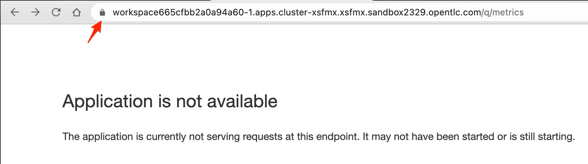

:guid: %guid%
:user: %user%

:openshift_user_password: %password%
:openshift_console_url: %openshift_console_url%
:user_devworkspace_dashboard_url: https://devspaces.%openshift_cluster_ingress_domain%
:user_devworkspace_url: https://devspaces.%openshift_cluster_ingress_domain%/dashboard/#/ide/%user%-devspaces/workshop-performance-monitoring-apps
:template-github-url: https://github.com/redhat-na-ssa/workshop_performance-monitoring-apps.git
:hyperfoil_web_cli_url: https://%user%:%password%@%user%-hyperfoil.%openshift_cluster_ingress_domain%
:grafana_url: https://grafana-route-grafana.%openshift_cluster_ingress_domain%

:sectlinks:
:sectanchors:
:markup-in-source: verbatim,attributes,quotes
:source-highlighter: highlight.js

= Load Testing, Scaling and Monitoring the Applications

== Monitoring

One of the first things you usually want to do once your application is deployed is to configure monitoring.
For this, we'll be using the Monitoring capability built in Openshift. This feature comes with a pre-set of ready to use dashboards for monitoring application's workload metrics right from the Openshift Console. 

We'll be also using link:https://grafan.com[Grafana] to visualize metrics provided out-of-the-box by the Openshift Monitoring Stack.

[NOTE]
====
The OpenShift Monitoring stack is based on the link:https://prometheus.io/[*Prometheus*] open source project and its wider ecosystem. To learn more about the Openshift Monitoring stack see link:https://docs.openshift.com/container-platform/4.12/monitoring/monitoring-overview.html[About OpenShift Container Platform monitoring].

*Grafana* is an open platform for beautiful analytics and monitoring. For more information please visit the link:https://grafana.com/oss/[Grafana website].

Red Hat provides an Openshift Operator to install and manage Grafana instances on your cluster. See link:https://operatorhub.io/operator/grafana-operator[Grafana Operator] in the Operator Hub for more details.
====

From the Openshift Console, Developer Perspective navigate to the link:{openshift_console_url}/dev-monitoring/ns/%user%-staging[Observe view^].
From there, select 

* *Dashboard*: `Kubernetes / Compute Resources / Namespaces (Workloads)`; and 
* *Type* `Deployment`.

To see more specific data you can drill into the Metric Graph by clicking the Inspect link (top right of the graph). This will open the metric view where you can
see the link:https://prometheus.io/docs/prometheus/latest/querying/basics/[Query (PromoQL)^] that brings this metric data point from the integrated *Prometheus Data Source*.

For instance, the Graph bellow shows the CPU usage for the `quarkus-app` for the last 5min.

Using the *Dashboard* and *Metric* views, you can select which metrics you want to observe, and the time range for the data.
The *Observe* view is contextual, which means it will present the data based on the project namespace you are in. So, you can observe the metrics for the workloads you have deployed into the current project namespace.
If you switch to a different namespace you should see the workloads deployed to that specific project namespace.

[TIP]
====
When you have multiple deployments (workloads) running in the current namespace you can notice that these graphs aggregates the data-points by POD. 
Take a look at the PromoQL of the following CPU metric graph.

====

[NOTE]
====
#At this point you don't have enough data points collected to visualize. That's fine as the goal of this section is to introduce you to the Openshift Monitoring Stack. In the next section we'll be executing a set of load tests that will generate lots of data metrics so you can use what we're introducing here to monitor our applications.#
====

=== Using Grafana to Visualize Metrics

Now lets look at the application metrics using a different tool that can be easily integrated with Openshift.
Because Openshift already uses Prometheus to gather and store cluster and application metrics you can easily integrate Grafana to create 
nice metric visualization dashboards for any workload running on Openshift.

Our Lab already has a Grafana instance fully integrated with Openshift's Monitoring stack. You can access link:{grafana_url}[Grafana Console by clicking here^].

To open one of the available dashboards: 

* click on the *General / Home* link at the top left 
* then click on *grafana | Go to folder* and 
* select *Kubernetes / Compute Resources / Namespace (Workloads)*
* at the top of this dashboard you can select your *namespace* ({user}-staging) and 'deployment' *type*.

This is the same data we just saw using the *Observe view* in the Openshift Developer Console, but now using a Grafana as a visualization tool. 

Grafana is a very powerful visualization tool that allows you to create rich dashboards to monitor your workloads and get data insights from them.
Creating customized dashboards is outside the scope of our lab but you can explore a vast library of tutorials on link:https://grafana.com/tutorials[Grafana website^].

[IMPORTANT]
====
It's important to notice that the metrics' data source (Prometheus) is the same regardless the visualization tool you are using.
====

=== Monitoring the JVM

Our Openshift cluster is configured to link:https://docs.openshift.com/container-platform/4.12/monitoring/enabling-monitoring-for-user-defined-projects.html[monitor *User Workloads*] in addition to the link:https://docs.openshift.com/container-platform/4.12/monitoring/monitoring-overview.html[*Platform Resources* monitoring]. With user workload monitoring enabled, only resources that can be seen from outside the container like _CPU_, _Memory_, _Networking_, _Storage_ are monitored. What about the *application metrics* like the JVM resources (Heap, GC, etc)? Because Openshift uses Prometheus underneath it monitoring stack, it becomes easy to expose application specific metrics to it.

So, let's expose our application metrics using application Prometheus extensions. Thankfully, all three application runtimes we've been using to build our apps already provide Prometheus extensions (libraries).

==== Exposing application metrics in Quarkus
Quarkus provides a link:https://quarkus.io/guides/micrometer[Micrometer extension] that makes it really easy to expose application metrics to Prometheus. All we need to do is to add the `quarkus-micrometer` extension to the app's POM.

[NOTE]
====
link:https://micrometer.io[Micrometer] is *Vendor-neutral application observability facade* that provides a simple facade over the instrumentation clients for the most popular observability systems, allowing you to instrument your JVM-based application code without vendor lock-in. Think SLF4J, but for observability.
====

In your link:{user_devworkspace_url}[DevWorkspace] open the `$PROJECT_SOURCE/quarkus-app/pom.xml` file and *uncomment (just move the `-- >` up to before `<dependency>` tag) the following section* (around line `#80`) to enable the extension.
[source, xml, ident=0]
----
    <!-- Enable Micrometer for prometheus metrics.
     Default metrics are exposed though /q/metrics endpoint
    -->
    <dependency>
      <groupId>io.quarkus</groupId>
      <artifactId>quarkus-micrometer-registry-prometheus</artifactId>
    </dependency>
----

And that's it! Now your Quarkus app will expose JVM specific metrics to Prometheus.
Now, lets test it.

From the DevWorkspace *Task Manager* run the task `03: Quarkus - Start in dev mode (Hot reload + debug)` to check our change.

[TIP]
====
Remember you can always execute maven manually from the Terminal if you prefer to.

[source, shell, role=copy]
-----
cd $PROJECT_SOURCE/quarkus-app
mvn quarkus:dev
-----
====

When the application starts inside the DevWorkspace, watch for a pop-up at the left bottom of the Terminal and click Open. Then access its `/q/metrics` context path (without the `/quarkus-app` root path!). You should see a bunch of metrics like:

[WARNING]
====
When opening the app endpoint from inside your DevWorkspace you may see it as unavailable like this:

It may happen your web browser automatically switches to `https` protocol and this app endpoint uses `http`. 
To solve that just change the protocol back to http using your browser address bar and hit refresh.
====

Alright, now lets push this change to our git repo and deploy it using our CI/CD pipeline.

1. commit your changes to you git repo.
+
[source,shell,role=copy]
----
cd $PROJECT_SOURCE/
git commit -am "exposing JVM metrics for quarkus-app"
git push
----
+
2. go to Openshift Console Developer perspective, switch to the `{user}-cicd` and link:{openshift_console_url}/dev-pipelines/ns/{user}-cicd[open the *Pipelines* view] from the left Menu.
+
[IMPORTANT]
====
If you don't remember how start a new Pipeline Run go back to the xref:../4-deploying-applications.adoc#running-pipeline[Pipeline section here^].

Remember to enter the correct params: `git repo url`, `app name` and your `quay.io account name`!
====
+
3. run the `build-and-deploy-apps` pipeline again to build and deploy the `quarkus-app` with this new change.
4. after the `Pipeline Run` completes successfully you can check the new app revision deployed to the `%user%-staging` project namespace by accessing its link:https://quarkus-app-%user%-staging.{openshift_cluster_ingress_domain}/q/metrics[external Route URL].

==== Exposing application metrics in Micronaut
Like Quarkus, Micrometer also provides a link:https://guides.micronaut.io/latest/micronaut-metrics-maven-java.html[Micrometer integration] that makes it really easy to expose application metrics to prometheus. All we need to do is to add the `micronaut-micrometer` dependency to the app's POM.

In your link:{user_devworkspace_url}[DevWorkspace] open the `$PROJECT_SOURCE/micronaut-app/pom.xml` and *uncomment (just move the `-- >` up to before `<dependency>` tag) the following section* (around line `#113`) to enable the extension.
[source, xml, ident=0]
----
    <!-- Enable Micrometer for prometheus metrics.
     Default metrics are exposed though /metrics and prometheus metrics thorugh /prometheus endpoint
    -->
    <dependency>
      <groupId>io.micronaut.micrometer</groupId>
      <artifactId>micronaut-micrometer-registry-prometheus</artifactId>
    </dependency>
----

Now we need to tell Micronaut to expose its runtime metrics to Prometheus. Open the `$PROJECT_SOURCE/micronaut-app/src/main/resources/#application.yml#` file and uncomment the the section `export` under `metrics`:

[source, yaml]
----
micronaut:
  application:
    name: MicronautApp
  server:
    port: 8080
    thread-selection: IO
  metrics:
    enabled: true
    export: #<=== HERE
      prometheus:
        enabled: true
        step: PT1M
        descriptions: true
----

[WARNING]
====
* #Don't forget this step otherwise Micronaut will not expose its metrics to Prometheus!#

* Make sure you made this change in the `#application.yml#` file (not the `application-dev.yml`)!

* Pay attention to the yaml indentation!
====

And that's it! Now your Micronaut app will expose JVM specific metrics to Prometheus.
Now, lets test it.

From the Task Manager run the task `05: Micronaut - Start in dev mode` to check our change.

When the application starts, open it in your browser (look for a popup at the left bottom of your IDE and click open). Then access the 
`/prometheus` context path (without the `/micronaut-app` root path!). You should see a bunch of metrics 

Alright, now lets push this change to our git repo and deploy it using our CI/CD pipeline.

1. commit your changes to you git repo.
+
[source,shell,role=copy]
----
cd $PROJECT_SOURCE/
git commit -am "exposing JVM metrics for micronaut"
git push
----
+
2. go to Openshift Console Developer perspective, switch to the `{user}-cicd` and link:{openshift_console_url}/dev-pipelines/ns/{user}-cicd[open the *Pipelines* view] from the left Menu.
3. run the `build-and-deploy-apps` pipeline again to build and deploy the `micronaut-app` with this new change.
4. after the `Pipeline Run` completes successfully you can check the new app revision deployed to the `%user%-staging` project namespace by accessing its link:https://micronaut-app-%user%-staging.%openshift_cluster_ingress_domain%/prometheus[external Route URL].

==== Exposing application metrics in Springboot
Like Quarkus and Micronaut, Springboot now provides a link:https://docs.spring.io/spring-boot/docs/current/reference/htmlsingle/#actuator.metrics.export.prometheus[Micrometer integration] that makes it really easy to expose application metrics to prometheus. All we need to do is to add the micrometer dependency to the app's POM.

In your link:{user_devworkspace_url}[DevWorkspace] open the `$PROJECT_SOURCE/springboot-app/pom.xml` and *uncomment (just move the `-- >` up to before `<dependency>` tag) the following section* (around line `#90`) to enable the extension.
[source, xml, ident=0]
----
    <!-- Enable Micrometer for prometheus metrics.
      Default metrics are exposed though /actuator/prometheus endpoint
    -->
    <dependency>
        <groupId>io.micrometer</groupId>
        <artifactId>micrometer-registry-prometheus</artifactId>
        <scope>runtime</scope>
    </dependency>
----

Now we need to tell Springboot to expose its runtime metrics to Prometheus. Open the `$PROJECT_SOURCE/springboot-app/src/main/resources/application.properties` file and add `prometheus` to the `management.endpoints.web.exposure.include` property:

[source, properties]
----
management.endpoints.web.exposure.include=health,info,prometheus
----

[WARNING]
====
#Don't forget this step otherwise Springboot will not expose its metrics to Prometheus!#
====

And that's it! Now your Springboot app will expose JVM specific metrics to Prometheus.
Now, lets test it.

From the Task Manager run the task `08: SpringBoot - Start in dev mode` to check our change.

When the application starts, open it in your browser (look for a popup at the left bottom of your IDE and click open). Then access the 
`/actuator/prometheus` context path (without the `/springboot-app` root path!). You should see a bunch of metrics like:

Alright, now lets push this change to our git repo and deploy it using our CI/CD pipeline.

1. commit your changes to you git repo.
+
[source,shell,role=copy]
----
cd $PROJECT_SOURCE/
git commit -am "exposing JVM metrics for springboot"
git push
----
+
2. go to Openshift Console Developer perspective, switch to the `{user}-cicd` and link:{openshift_console_url}/dev-pipelines/ns/{user}-cicd[open the *Pipelines* view] from the left Menu.
3. run the `build-and-deploy-apps` pipeline again to build and deploy the `springboot-app` with this new change.
4. after the `Pipeline Run` completes successfully you can check the new app revision deployed to the `%user%-staging` project namespace by accessing its link:https://springboot-app-%user%-staging.%openshift_cluster_ingress_domain%/actuator/prometheus[external Route URL].

==== Using Grafana to visualize Application JVM metrics
Once you have micrometer enabled in your applications you should be able to visualize application specific metrics using Grafana.
Open the link:{grafana_url}[Grafana console] and navigate the the *JVM (Micrometer)* dashboard. You can now monitor many metrics that are specific to your Java workload. Make sure you select the namespace related to your user.

image::../imgs/module-5/grafana_jvm_micrometer_metrics.gif[Grafana JVM metrics]

[NOTE]
====
All the data metrics you see in this dashboard are being automatically captured by the Openshift Metrics stack based on Prometheus.
This dashboard was pre-loaded for you in our Lab Grafana instance, but with the right permissions you can freely customize it, create or import new ones.
====

All the graphs presented in this section are better seen with real-time data! 
So we encourage you to visualize them during the load testing execution. This way you will be able to see how your apps behave when serving real traffic.