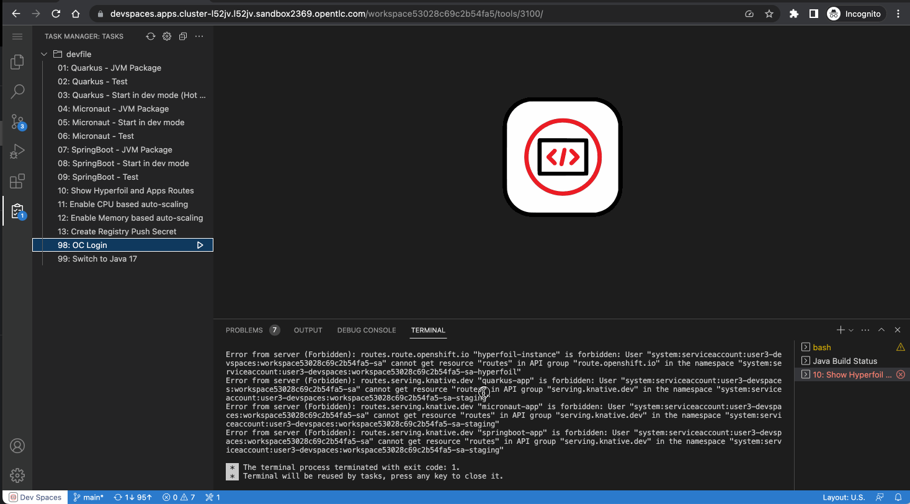

:guid: %guid%
:user: %user%

:openshift_user_password: %password%
:openshift_console_url: %openshift_console_url%
:user_devworkspace_url: https://devspaces.%openshift_cluster_ingress_domain%
:hyperfoil_web_cli_url: https://%user%-hyperfoil.%openshift_cluster_ingress_domain%
:hyperfoil_web_cli_url_auth_creds: https://%user%:%password%@%user%-hyperfoil.%openshift_cluster_ingress_domain%
:hyperfoil_benchmark_definition_url: https://raw.githubusercontent.com/redhat-na-ssa/workshop_performance-monitoring-apps-template/main/scripts/hyperfoil/summit-load-apps.hf.yaml
:grafana_url: https://grafana-route-grafana.%openshift_cluster_ingress_domain%

:sectlinks:
:sectanchors:
:markup-in-source: verbatim,attributes,quotes

= Lab Troubleshooting

== Git issues
Possible Git/Github issues you may face when setting up your DevWorkspace.

=== Wrong git credentials
You DevWorkspace is configured to use Git cache store to avoid git to ask for your git credentials every time you try to push a change to your repo.

When doing a `git push`, if you get any authentication error due to a wrong token. you can invalidate/clean up the local git credentials cache by executing the following command in a Terminal:

[source, shell, role=copy]
----
git config --global --unset credential.helper
git config --local --unset credential.helper
----

=== Github Password authentication

If you tried to authenticate against Github using your account password you should see an error message like this when trying `git push`:

[source, shell]
----
remote: Support for password authentication was removed on August 13, 2021.
remote: Please see https://docs.github.com/en/get-started/getting-started-with-git/about-remote-repositories#cloning-with-https-urls for information on currently recommended modes of authentication.
fatal: Authentication failed for 'https://github.com/your-gb-account/rhsummit2023-java-performance-monitoring.git/'
----

In this case you need to invalidate the git cache store by executing:

[source, shell, role=copy]
----
git config --global --unset credential.helper
git config --local --unset credential.helper
----

and use a *Personal Access Token* instead of your account password. See setup section to setup a Personal Access Token in your Github Account.

=== Git push rejected

If your `git push` fails with a similar message like this:

[source, shell]
----
workshop-performance-monitoring-apps (main) $ git push
To https://github.com/your-github-account/rhsummit2023-workshop-performance-monitoring.git
 ! [rejected]        main -> main (non-fast-forward)
error: failed to push some refs to 'https://github.com/your-github-account/rhsummit2023-workshop-performance-monitoring.git'
hint: Updates were rejected because the tip of your current branch is behind
hint: its remote counterpart. Integrate the remote changes (e.g.
hint: 'git pull ...') before pushing again.
hint: See the 'Note about fast-forwards' in 'git push --help' for details.
----

It may happen the Workshop Template repo got updated recently (after our lab environment got created) and is not in-sync with your fork.
To solve this issue just do the following before you can push your changes:

[source, shell, role=copy]
----
git pull --rebase
----

Now you should be able to do a `git push` your changes!

=== Git push get stuck

If your `git push` get stuck without asking for your credentials.

Try to invalidate/clean the git cache store configuration and set the origin remote url explicitly passing your github account name like:

[source, shell]
----
git remote set-url origin https://YOUR-ACCOUNT-NAME-HERE@github.com/YOUR-GIT-ACCOUNT-HERE/rhsummit2023-workshop-performance-monitoring.git
----

Now you should be able to do a `git push` and see a prompt asking for your credentials.

== Error while creating Quay Secret

Your user does not have permission to delete or edit secrets in the `cicd` namespace. If you missed something in this step, call an instructor the delete the secret for you. 

== Openshift forbidden error

When executing any command or Task in the DevWorkspace's Terminal...
If you see any error similar to the following

```
Error from server (Forbidden): ... is forbidden: User "system:serviceaccount:%user%-devspaces:workspace53028c69c2b54fa5-sa" cannot get resource ... in API group ... in the namespace "system:serviceaccount:%user%-..."
```

It may happen your DevWorkspace was not able to inject your user information properly during its initialization.
To solve that issue, from the IDE *Task Manager* please, execute the *Task* named `98: OC Login`. You will be prompted to enter your assigned user password: `%password%`.




== Hyperfoil Web CLI Authentication

When trying to access the WebCLI for the first time you will be prompted to enter you Lab credentials.

If for some reason you enter the wrong credentials you have to close the current browser window or open a new one in Incognito mode.
That's because Hyperfoil Web CLI currently uses Http Basic Authentication. To avoid that you can type your credential right in the URL address bar: link:{hyperfoil_web_cli_url_auth_creds}[]

This way you don't have to close your current browser window or open a new one in Incognito.

If you take too much time with you Web CLI idle in a browser window, you may also see an error message like this

```
ERROR: Failed to retrieve source for benchmark summit-lab-load-apps: Server responded with unexpected code: 401, UnauthorizedERROR: Server responded with unexpected code: 401, Unauthorized
```

In this case try to use this url link:{hyperfoil_web_cli_url_auth_creds}[] to authenticate the Hyperfoul Web CLI again.

